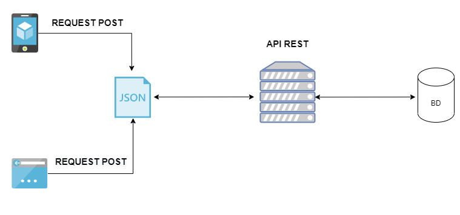

# Construindo uma API REST para cadastro De Imoveis com Spring Web

O protocolo HTTP tem como objetivo realizar comunicação de arquivos de midia entre sistemas distribuidos, por hora entendemos que é baseado em uma comunicação cliente e servidor, ou seja, o cliente envia uma solicitação para o servidor que é chamada de request (requisição), onde o servidor a recebe executa algum processamento e o devolve uma response (resposta). A dinamica da comunicação é feita atraves de documentos, onde em uma requisição o cliente terá que enviar para um determinado endereço e caminho, o  metodo que deseja utilizar , a versão do protocolo, um conjunto de headers (cabecalhos) e opcionalmente um conjunto de informações no body (corpo). Já a respósta é dada a versão do protocolo, status code, status message, um conjunto de headers e opcionalmente unm conjunto de informações  no body.

## E o que é uma  API REST ?? 

Primeiro vamos nos atentar em oque é uma API, que nada mais é do que um conjuto abstrações que permitem que outros softwares consigam utilizar suas funcionalidades sem a necessidade de conhecimento do codigo que é escrito para realizar a mesma, favorecendo que chamamos de interoperabilidade que é capacidade de um sistema se comunicar com outros de maneira simples e transparente. O acronimo API  vem de Application Programming Interface ou Interface de Programação de Aplicações em português, para entender melhor imagine que foi a um restaurante, e quer fazer seu pedido, você não vai até a cozinha e solicita diretamente ao cheff o que deseja comer, você se comunica com o garçom, ele anota seu pedido e leva ao cheff e no momento que ta pronto ele, traz a sua mesa. Observer que o graçom abstrae toda a comunicação com o cheff, ou seja, ele é uma interface de comunicação que os clientes usam para comunicar com cheff logo ele é API deste contexto.

Relembrando que REST é um padrão arquitetural de software que especifica como deve ser feito o uso do protocolo HTTP, ou seja, ele define que os Web Services, devem se comunicar atráves do protocolo utilizando a especificação para gerenciar o estado dos recursos. Para entender um pouco melhor o protocolo HTTP contem diversos métodos entre eles estão POST, GET, PUT, DELETE e etc. Cada um destes para realizar uma determinada funcionalidade  o metodo POST quando iremos criar  um novo recurso, o GET para consultar informações de um recurso, o PUT é uma forma de atualizar totalmente as informações de um recurso, e o DELETE para remover um determinado recurso. Aliado a cada metodo existe um Status Code apropiado a cada resposta, e uma forma de trafegar as informações.

Então uma API REST nada mais é que um Web Service, que se comunica atráves do protocolo HTTP respeitando suas regras e rotinas de comunicação. O cliente envia uma requisição através de um endereço e verbo, é enviado no corpo da requisição informações em algum formato os mais comuns são JSON ou XML. O servidor recebe a requisição realiza algum processamento e devolve uma resposta. Imaginamos um pouco de como é o fluxo de uma API na imagem abaixo.

<p align="center">

</p>


## Construindo uma API REST para cadastro de Imoveis com Spring e Jpa/Hibernate

O primeiro passo ao construir uma API é determinar qual é o recurso que sera gerenciado, no nosso caso é um Imovel, então entendemos que cada um dos imovéis tera um indentificador unico que facilitara a dinamica de operações sobre o mesmo. 

Definiremos agora qual endereço e verbo será utilizado para realizar os cadastros, é muito comum que é nome do caminho seja usado no plural pois existiram mais de um recurso do tipo. Então vamos modelar o acesso a seguinte forma:

1. O servidor atendera as chamadas no endereço: /imoveis
2. O metodo que será utilizado será POST
3. No corpo da requisição devera conter um JSON com as seguintes informações:
    - 3.1 Quantidade de quartos
    - 3.2 Quantidade de banheiros
    - 3.3 Ano da construção
    - 3.4 Area construida em metros quadrados
    - 3.5 Se possui garagem, neste campo deve ser utilizado somente valores true ou false
4. Em caso de sucesso o servidor retornar um HTTP Status 201 e um cabeçalho location com endereço para consulta do recurso.

## Construindo o Controller

O primeiro ponto que iremos definir é o de acesso externo ou seja, iremos construir uma classe que será responsavel por atender as solicitações que chegarem para o endereço /imoveis e o verbo POST. O Spring utiliza de anotações para realizar diversas configurações, como determinar um endereço de acesso a uma classe ou metodo, determinar que as informações que estão no corpo da requisição seram desserializada em uma classe entre outras.  Observaremos abaixo a classe CadastrarNovoImovelController.


```java
@RestController
public class CadastrarNovoImovelController {

    private final ImovelRepository repository;

    public CadastrarNovoImovelController(ImovelRepository repository) {
        this.repository = repository;
    }

    @PostMapping("/imoveis")
    public ResponseEntity<Void> cadastrar(@RequestBody ImovelRequest request,   UriComponentsBuilder uriComponentsBuilder){

        Imovel novoImovel = request.paraImovel();

        repository.save(novoImovel);

        URI location = uriComponentsBuilder.path("/imoveis/{id}")
                .buildAndExpand(novoImovel.getId())
                .toUri();

        return ResponseEntity.created(location).build();
    }

}
```

 É uma classe bem simples, porém são muitas responsabilidades e muita informação precisa ser explicada nesta classe. Vamos dividir por partes, iremos começar pelas anotações.

 1. @RestControlller esta anotação é responsavel por endereçar que esta classe será responsavél por receber requisições HTTP e que as Informações que serão devolvidas no corpo da resposta trafegaram em JSON. 

 2. @PostMapping esta anotação define que as requisições HTTP com metodo POST para o endereço /imoveis serão atendidas pelo metodo cadastrar.

 3. @RequestBody esta anotação define que as informações que seram informadas no corpo da requisição HTTP serão desserializadas no Objeto do tipo ImovelRequest. 

 Com estas anotações configuramos esta classe para receber as chamadas HTTP POST  para receber as informações e o corpo do metodo cadastrar cuida de realizar a persistencia no banco de dados. 

 Para explorar um pouco melhor esta solução observaremos a classe ImovelRequest e iremos construir um JSON que ela representa.

 ```java
 public class ImovelRequest {
    private Integer quantidadeQuartos;
    private Integer quantidadeBanheiros;
    private Integer areaConstruidaEmMetrosQuadrados;
    private Integer anoDeConstrucao;
    private Boolean possuiGaragem;

    public ImovelRequest(Integer quantidadeQuartos, Integer quantidadeBanheiros, Integer areaConstruidaEmMetrosQuadrados, Integer anoDeConstrucao, Boolean possuiGaragem) {
        this.quantidadeQuartos = quantidadeQuartos;
        this.quantidadeBanheiros = quantidadeBanheiros;
        this.areaConstruidaEmMetrosQuadrados = areaConstruidaEmMetrosQuadrados;
        this.anoDeConstrucao = anoDeConstrucao;
        this.possuiGaragem = possuiGaragem;
    }


    public Imovel paraImovel(){
        return new Imovel(quantidadeQuartos,quantidadeBanheiros,areaConstruidaEmMetrosQuadrados,anoDeConstrucao,possuiGaragem);
    }
    
    //getters e setters omitidos aqui
 }
 ```
Notamos que esta classe carrega apenas as informações referentes a um imovel, como a quantidade de quartos, banheiros, area construida em metros quadrados, se possui garagem ou não, veremos agora um JSON referente a esta classe.

```json
    {
        "quantidadeQuartos":2,
        "quantidadeBanheiros":1,
        "areaConstruidaEmMetrosQuadrados":60,
        "anoDeConstrucao": 2002,
        "possuiGaragem": true
        
    }
```
Ao olhar para o metodo paraImovel() da classe ImovelRequest, é chamado o construtor da classe Imovel, e as informações que estão em cada atributo são encaminhadas para o construtor formando  um novo objeto do tipo Imovel em memoria. Observe na pratica a chamada:

```java
public Imovel paraImovel(){
        return new Imovel(2,1,60,2002,true);
    }

```

Voltamos a classe CadastrarNovoImovelController no metodo cadastrar(), essas informações são persistidas na chamada no metodo, repository.save(novoImovel). Por fim é feito a logica de criação da URI deste imovel, caso seja o primeiro a ser cadastro é feito a URI: /imoveis/1, que é informada no cabeçalho location, junto a o Status CREATED 201.