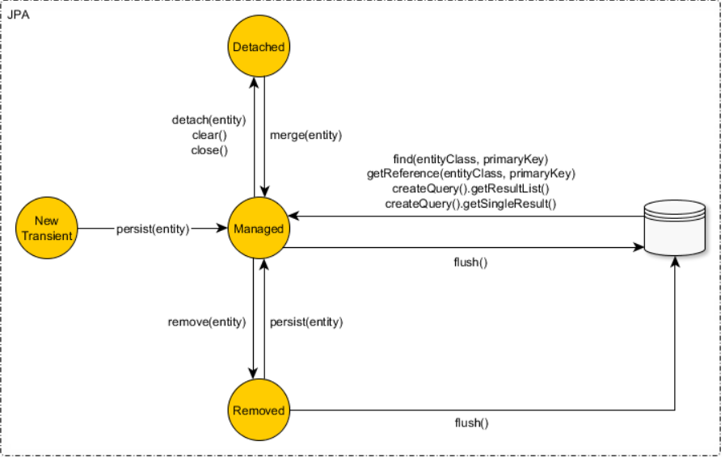

# Desmistificando o EntityManager

Ao utilizar a JPA/Hibernate o objetivo do desenvolvedor(a) é pensar em função de objetos, atributos e suas associações em vez de tabelas, colunas e relacionamentos, o que muitas vezes leva a se distanciar da escrita de operações SQL. Dessa forma, conseguimos modelar nosso domínio através de entidades que se relacionam e escrever lógicas de negócio sem se preocupar em traduzir para SQL as alterações feitas nas entidades. O framework ORM, no caso JPA e Hibernate, é que se encarrega de fazer a parte "chata": sincronizar os objetos em memória com as tabelas no banco de dados. 

A JPA disponibiliza o `EntityManager` que é uma abstração que nos permite realizar operações junto ao banco de dados (DB) a nível de entidades (objetos), para que estas operações sejam sincronizadas e propagadas para banco, é necessário que a entidade esteja no estado gerenciado, também conhecido como `MANAGED`. Os objetos gerenciados pela JPA ficam em um contexto especial em memória conhecido como **Contexto de Persistência**, e este contexto é implementado através da `EntityManager`. Abaixo você encontrará a descrição dos estados a qual uma entidade pode ocupar:

- `Transient`: É quando um objeto acaba de ser criado porém não foi associado ao Contexto de Persistência, isso quer dizer que ele não esta mapeado a nenhuma lima da tabela do banco, ou seja, ainda não possui chave primaria;

- `Managed`: É quando a entidade em memoria esta associada a uma linha da tabela no banco de dados, ou seja, ela possui um ID. Quando a entidade esta neste estado ela é gerenciada pelo Contexto de Persistência, e qualquer alteração feita nesta entidade é detectada pelo Hibernate que por sua vez traduz sincroniza com o banco através de comandos SQL;

- `Detached`: É quando o Contexto de Persistência é encerrado, e as determinadas entidades não estão mais em sincronia com banco, isso quer dizer que qualquer alteração feita posteriormente não será propagada para o banco;

- `Removed`: Ao removermos uma entidade, ela não é de fato deletada do banco, mas apenas marcada como removida dentro do Contexto de Persistência, e, em um momento oportuno, o Hibernate se encarrega de sincronizar com o banco via operação de `DELETE`.

Para que a entidade transite entre os estados, devemos utilizar os metodos do `EntityManager`, veja o diagrama abaixo: 



## Entendendo as Operações do `EntityManager`

No decorrer da nossa experiência com JPA/Hibernate aprendemos a utilizar o metodo `persist()` quando desejamos inserir as informações de um objeto em uma linha na tabela do banco. Já o metodo  `merge()` associamos a realizar alterações a determinada entidade, e por fim o metodo `remove()` quando desejamos deletar um registro de nossa tabela. Este conhecimento por si não esta errado, porém existe alguns detalhes sobre os metodos `persist` e `merge` que passam despercebidos e vamos explorar os mesmos agora.

## Como funciona o `EntityManager.persist()` 

A responsabilidade deste metodo é colocar uma instância da entidade no estado `Managed`, isso significa que dado que exista uma transação aberta, a JPA/Hibernate ira propagar o SQL necessário ao banco. 

Se observamos o contrato deste metodo ele recebe uma referência a entidade, e não possui retorno. Isto quer dizer que as informações que são alteradas dentro da transação são alteradas em memoria no objeto de referência.

Para enteder melhor o que acontece, imagine que existe uma funcionalidade para cadastrar uma entidade Livro, mapeada abaixo:

```java
@Entity
public class Livro {

    @Id
    @GeneratedValue
    private Long id;
    
    @Column(nullable=false)
    private String titulo;
    
    // construtores e getters
}
```

Agora desejamos vincular uma instância deste objeto a uma linha do banco de dados, primeiro precisamos nos certificar que exista uma transação aberta. Dado que exista a transação chamaremos o metodo `persist` do `EntityManager`, veja o codigo abaixo.

```java
@Transactional
public void cadastrar(Livro livro) {
    entityManager.persist(livro);
} 
```

Neste momento é disparado a seguinte operação SQL:

```sql
    INSERT INTO livro (id, titulo) VALUES (?, ?) 
```

Repare que é  dado um ID a esta entidade, e por referência de memoria, o atributo `id` recebe o valor gerado no banco (via sequence ou auto-incremento). Para verificar podemos utilizar o metodo `getId()`, que obteremos o valor.

Podemos utilizar o metodo `EntityManager.contains()` para verificar se uma determinada entidade esta presente no Contexto de Persistência. Para isso, criamos o seguinte teste para validar:

```java
@SpringBootTest
public class TestandoEntityManagerMetodos {

    @Autowired
    private EntityManager manager;

    @Transactional
    @Test
    public void devePersistirUmLivro() {

        Livro livro = new Livro("Clean Code");
        manager.persist(livro);

        assertNotNull("entidade MANAGED possui um ID", livro.getId());
        assertTrue("entidade MANAGED está dentro do contexto de persistência", manager.contains(livro));
    }
}

```

## Como funciona o `EntityManager.merge()` 

O comportamento do método `merge()` é **reanexar** uma entidade `Detached` ou  `Transient` ao Contexto de Persistência, ou seja, transitá-la para o estado `Managed`. Dado que existe um objeto em memoria que é passado como parâmetro para o método `EntityManagaer.merge()`, é feito uma verificação se este existe no Contexto de Persistencia, caso não exista é feita uma operação SQL de `INSERT` no banco, caso exista, a JPA procura o objeto de destino no Contexto de Persistência e atualiza suas as informações com objeto em memoria e, por fim, retorna a instância `Managed`.

Geralmente usamos o método `merge` para entidades `Detached`, como abaixo:

```java
Livro livro = new Livro();  
livro.setId(14582); // detached

Livro livroManaged = entityManager.merge(livro); // retorna instância managed
```

Mas podemos também utilizar o método `merge` em entidades `Transient`. Para entender melhor, observe o teste abaixo:

```java
@SpringBootTest
public class TestandoEntityManagerMetodos {

    @Autowired
    private EntityManager manager;


    @Transactional
    @Test
    public void devePersistirUmNovoLivro() {

        Livro livro = new Livro("Clen Code"); // transient
        Livro livroManaged = manager.merge(livro);  // retorna instância managed

        assertNull("nao tem ID atribuido"                 , livro.getId());
        assertFalse("nao esta no contexto de persistencia", manager.contains(livro));
        assertNotNull("possui ID atribuido"               , livroManaged.getId());
        assertTrue("esta no contexto de persistencia"     , manager.contains(livroManaged));
    }
}
```

Podemos observar que o objeto `livro` não esta presente no Contexto de Persistência e nem que seu ID esta preenchido. Já o `livroManaged` contém um ID e esta presente no contexto de persistência. O que quer dizer que qualquer alteração em `livro` não será detectado pela JPA, enquanto qualquer alteração em `livroManaged` será detectado pela JPA e sincronizado com o banco.

## Inserir nova entidade com `persist` ou `merge`?

Se ambos os métodos `persist` e `merge` inserem entidades no banco de dados, por que não podemos simplesmente utilizar o `merge` para inserir e atualizar entidades?

A verdade é que podemos sim utilizar o `merge` para inserir, contudo isso **não é recomendado**. Idealmente devemos usar o método `persist` para inserir novos objetos no banco de dados.

Um dos problemas de usar `merge` para inserir objetos no banco tem a ver com operações em cascata. Quando uma entidade possui relacionamentos com operações em cascata habilitado, pode ocorrer comportamentos inesperados ao propagar a operação `MERGE`. Para entender melhor o que estou querendo dizer, vamos avaliar alguns cenários no uso dos métodos `persist` e `merge`. 

## Como funciona a propagação em Cascasta dos metodos `persist` e `merge`

A JPA/Hibernate oferece atráves de mapeamento a possibilidade de propagar em cascata as operações do `EntityManager` para os relacionamentos de uma entidade.
Para tirar proveito deste recurso em um determinado relacionamento devemos junto a anotação de cardinalidade, definir as operações no atributo `cascade`. Veja um exemplo abaixo:


```java
@Entity
public class Capitulo {

    @Id
    @GeneratedValue
    private Long id;
    
    private String nome;

    @ManyToOne
    private Livro livro;

    // construtores e getters

}

@Entity
public class Livro {

    @Id
    @GeneratedValue
    private Long id;
    
    private String titulo;

    @OneToMany(mappedBy = "livro", cascade = { CascadeType.PERSIST, CascadeType.MERGE })
    private List<Capitulo> capitulos = new ArrayList<>();

    // construtores e getters

    /**
     * Adiciona capitulo ao livro
     */
    public void adicionar(Capitulo capitulo) {
        capitulo.setLivro(this);
        this.capitulos.add(capitulo);
    }

}
```

Para entender o comportamento das propagações, vamos inserir um livro com um capitulo e aplicar os metodos `persist` e `merge`.

### Propagando operações em relacionamentos utilizando o `EntityManager.merge()`

Para verficar o comportamento do metodo `merge`, observamos o caso de teste abaixo, dado que existe um Livro no estado `Managed`, o que acontece ao adicionar um `Capitulo` que esta no estado `Transient` a ele:

```java
@Test
@Transactional
public void devePropagarOperacaoMerge() {

    Capitulo capitulo = new Capitulo("Dependency Inversion"); // transient

    Livro livro = manager.find(Livro.class, 1L); // managed
    livro.adicionar(capitulo);

    manager.merge(livro);

    assertNull("nao possui um ID atribuido", capitulo.getId());
    assertFalse("nao esta no contexto de persistencia", manager.contains(capitulo));

    assertNotNull("possui um ID atribuido" , livro.getCapitulos().get(0).getId());
    assertTrue("esta no contexto de persistencia", manager.contains(livro.getCapitulos().get(0)));

    assertNotSame("sao instancias diferentes", capitulo, livro.getCapitulos().get(0));
}
```

Observe que o objeto `capitulo` não tem sua referência atualizada, porém se percorremos a coleção de capitulos de um `livro` encontramos a referência atualizada, afinal o objeto `livro` está `Managed`. Isso acontece pois o comando `merge` da `EntityManager` não altera o objeto passado como referência, seja este objeto passado diretamente para o método `merge` ou via operações em cascata.

Também observamos que as instâncias dos capitulos **não** são iguais, e o objeto `capitulo` passado como referência não está presente no Contexto de Persistência.

### Propagando operações em relacionamentos utilizando o `EntityManager.persist()`

```java
@Test
@Transactional
public void devePropagarOperacaoPersist() {

    Capitulo capitulo = new Capitulo("Dependency Inversion"); // transient

    Livro livro = manager.find(Livro.class, 1L); // managed
    livro.adicionar(capitulo);

    manager.persist(livro);

    assertNotNull("possui um ID atribuido", capitulo.getId());
    assertTrue("esta no contexto de persistencia", manager.contains(capitulo));

    assertNotNull("possui um ID atribuido", livro.getCapitulos().get(0).getId());   
    assertTrue("esta no contexto de persistencia", manager.contains(livro.getCapitulos().get(0)));
    
    assertSame("são a mesma instância", capitulo, livro.getCapitulos().get(0));
}
```

Já quando aplicamos o metodo `persist` observamos que o objeto `livro` tem um ID atribuido a ele, e que sua instância é a mesma que esta presente na coleção, e que agora ela é gerenciada pelo Contexto de Persistência.

## Deixando a JPA decidir como propagar as operações em cascata

Como sabemos, toda entidade em estado `Managed` é gerenaciada pela JPA, ou seja, qualquer alteração feita na entidade é detectada pelo contexto de persistência e sincronizada com o banco de dados. Esse mecanismo de detecção e sincronização é chamado de **Dirty Checking**, ou do português, Checagem de Sujeira. O dirty checking pode ocorrer em alguns momentos no ciclo de vida de uma entidade, mas geralmente ele vai ocorrer no último momento: no commit da transação.

A verdade é que no commit da transação a JPA gera os comandos SQL de acordo com as mudanças nas entidades enfileiras em memoria e envia para o banco de dados, e, só então, finaliza com o comando `COMMIT`. Essa geração de comandos SQL que são enviadas para o banco é chamada de `Flushing`, e podemos dispara-la manualmente através do método `flush` da `EntityManager` quando necessário:

```java
manager.getTransaction().begin(); // inicia a transação

Livro livro = manager.find(Livro.class, 1L); // managed
livro.setTitulo("novo titulo");

manager.flush(); // gera UPDATE e envia para o banco

livro.setTitulo("outro novo titulo");

manager.getTransaction().commit(); // gera outro UPDATE, envia para o banco e comita a transação
```

Agora, para entender melhor como a JPA decide qual operação em cascata propagar ao fazer flushing explicito ou comitar a transação, basta olhar o código de teste a seguir:

```java
@Test
@Transactional
public void deveSincronizarComBanco() {

    Capitulo capitulo = new Capitulo("Dependency Inversion");

    Livro livro = manager.find(Livro.class, 1L); // managed
    livro.adicionar(capitulo);

    manager.flush(); // propaga PERSIST em vez de MERGE: gera comandos SQL e envia para o banco

    assertNotNull("possui um ID atribuido", capitulo.getId());
    assertTrue("esta no contexto de persistencia", manager.contains(capitulo));

    assertNotNull("possui um ID atribuido", livro.getCapitulos().get(0).getId());   
    assertTrue("esta no contexto de persistencia", manager.contains(livro.getCapitulos().get(0)));
    
    assertSame("são a mesma instância", capitulo, livro.getCapitulos().get(0));
}
```

No caso acima a JPA/Hibernate detecta que a entidade `livro` foi alterada, identifica que um novo `capitulo` foi adicionado a coleção e por fim decide propagar a operação `PERSIST` em vez de `MERGE`. Por esse motivo, isso quer dizer que o objeto `capitulo` agora é gerenciado (`Managed`). E, geralmente, este é o comportamento que esperamos.

## E quando falamos de Spring Data JPA, como funciona os metodos `save()` e `saveAndFlush()`

Spring Data JPA facilita demais a vida dos desenvolvedores, pois ele abstrai muitos detalhes do framework de persistência, mas isso não quer dizer que não devemos entender como ele funciona. A verdade, é que entender o comportamento dos metodos `save` e `saveAndFlush` nos permite extrair o maximo deles em nosso dia a dia. Abaixo veremos como cada um funciona:
  
- `save()`: primeiro é feito uma verificação se a entidade esta no estado `Transient`, caso esteja é feito uma chamada ao metodo `entityManager.persist()`; caso contrário é feito uma chamada ao metodo `entityManager.merge()`;

- `saveAndFlush()`: primeiramente é chamado o metodo `save`, e em seguida a chamada ao metodo `entityManager.flush()` que esta encapsulado no metodo `flush()` do repository;

Perceba que os métodos de persistência de um Repository são apenas "wrappers" para as operações da `EntityManager`, o que siginifica que o resultado final é dado pela JPA e Hibernate. Contudo, a "inteligência" do método `save()` pode gerar alguma confusão para o desenvolvedor(a) na hora de manipular as entidades, pois as chances são de que o desenvolvedor(a) espere entidades `Managed` mas na verdade elas estão `Transient` ou `Detached`.

Para evitar essa confusão, nós entendemos que a melhor alternativa é deixar a JPA decidir como sincronizar as entidades e propagar as operações em cascata, e como vimos, fazemos isso invocando o método `flush`, como abaixo: 

```java
@Transactional
public void adicionarCapituloALivro(Long idLivro) {

    Capitulo capitulo = new Capitulo("Segregação de Interface"); // transient

    Livro livro = repository.findById(idLivro).get(); // managed
    livro.adicionar(capitulo);

    repository.saveAndFlush(livro); // propaga-se o MERGE

    system.out.println("id capitulo: " + capitulo.getId());
} 
```

Ao rodar o código acima, reecebemos no console a seguinte mensagem:

```
id capitulo: null
```

Isso acontece pois o Repository disparou o comando `merge` da `EntityManager`, o que por sua vez propagou a operação `MERGE` nas entidades filhas.

E, para que a gente consiga obter este `id` diretamente na instância de `capitulo`, recomendamos invocar o método `flush` para que o mecanismo de checagem da JPA decida qual operação propagar, que neste caso será a operação `PERSIST`. Para isso, vamos substituir a chamada do metodo `saveAndFlush()` por simplesmente `flush()`:

```java
@Transactional
public void adicionarCapituloALivro(Long idLivro) {

    Capitulo capitulo = new Capitulo("Segregação de Interface"); // transient

    Livro livro = repository.findById(idLivro).get(); // managed
    livro.adicionar(capitulo);

    repository.flush(); // JPA decide o que propagar, nesse caso um PERSIST

    system.out.println("id capitulo: " + capitulo.getId());
} 
```

Dessa forma, recebemos no console a seguinte mensagem:

```
id capitulo: 1
```

Podemos concluir que para casos onde precisamos que a persistência seja feita antes do termino da transação é mais indicado que deixarmos que a JPA decida qual a operação mais apropriada seja propagada. Não à toa, uma das maiores referências de JPA e Hibernate, Vlad Mihalcea, tem a mesma opinião:

> While a save method might be convenient in some situations, in practice, you should never call `merge` for entities that are either new or already managed. As a rule of thumb, you shouldn’t be using `save` with JPA. For new entities, you should always use `persist`, while for detached entities you need to call `merge`. **For managed entities, you don’t need any save method because Hibernate automatically synchronizes the entity state with the underlying database record.**

## Referências

- [How do persist and merge work in JPA](https://vladmihalcea.com/jpa-persist-and-merge/)
- [A beginner’s guide to entity state transitions with JPA and Hibernate](https://vladmihalcea.com/a-beginners-guide-to-jpa-hibernate-entity-state-transitions/)
