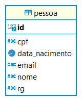
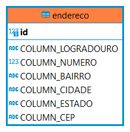

# Mapeamento Objeto Relacional com Jpa/Hibernate


o mercado de desenvolvimento de software é formado pela combinação de diversas técnicas, ferramentas e técnologias para resolver problemas empresarias rotineiros. Dentre essas ferramentas existem a Programação Orientada a Objetos, que tem como objetivo representar as informações de um problema em objetos, onde estes possuem suas proprias caracteristicas (atributos) e  comportamentos (metodos) que podem ou não interagir com outros objetos. Outra ferramenta que é amplamente ultilizada são os Sistemas de Banco de Dados, principalmente os baseados em SQL, que tem uma estrutura para armazenar, consultar, e atualizar informações baseado na teoria da algebra relacional. 

Então torna-se papel do desenvolvedor em suas rotinas de produção de software, escrever codigo orientado a objetos e utilizar drivers para fazer conexão e realizar operações em banco de dados (BD) relacionais. É comum que  o proprio desenvolvedor seja responsavel por definir o banco de dados, criar consultas, escrever as operações de inserção, remoção e atualização em SQL e submeter através do driver informações que estão mapeadas na memoria do softare atráves de objetos que representem as tabelas que estão na armazenadas no BD. O custo de tempo para escrever todos essses scripts SQL que são recorrentes e pouco alteraveis, é consideravelmente alto, e poderia ser utilizado para construção de funcionalidades que agregam maior valor ao sistema. Visando a diminuição do tempo para escrita de operações aos bancos de dados surgiu-se o que chamamos de Mapeamento Objeto Relacional, que é uma tecninca onde defimos quais classes em nosso software representam as entidades no banco de dados, e é oferecido uma serie de abstrações para que seja possível realizar operações de inserção,remoção, atualização e até mesmo escrita de schemas através da notação de objetos.


O Mapeamento de Objeto Relacional (ORM) nasceu com objetivo de escalar a produtividade de desenvolvedores que tem necessidade de representar as entidades do banco de dados em classes dentro de um software, e submeter scrpits SQL recorrentemente com as informações que estão armazenadas nas classes as respectivas entidades ao qual representam. Os frameworks ORM oferecem atraves de APIs funcionalidades para determinar qual classe faz referência a qual tabela no BD. E também oferece funcionalidades que abstraem a escrita dos scripts de inserção, atulização, consulta e remoção ao BD.

## Mapeando minha primeira entidade

Obsevamos na imagem abaixo uma tabela responsavel por armazear informações sobre uma pessoa. Neste contexto as informações que são relevantes sobre a pessoa são rg, cpf, nome, email e data de nascimento. Esta tabela tem como chave primaria um campo numerico unico que é atribuido a cada pessoa. 

<p align="center">

</p>


Criaremos uma classe que terá como responsabilidade unica fazer menção a tabela Pessoa, com atributos referêntes a cada coluna da tabela. E sobre a assinatura da classe anotaremos com @Entity, esta anotação é responsavel por definir que a classe Pessoa representa uma tabela com o mesmo nome.

```java
  @Entity
  public class Pessoa {
    private Long id;
    private String nome;
    private String cpf;
    private String email;
    private String rg;
    private LocalDate dataNacimento;

    public Pessoa(String nome, String cpf, String email, String rg, LocalDate dataNacimento) {
        this.nome = nome;
        this.cpf = cpf;
        this.email = email;
        this.rg = rg;
        this.dataNacimento = dataNacimento;
    }

    /**
     * @deprecated construtor para uso exclusivo do hibernate
     */
    @Deprecated
    public Pessoa(){

    }
}
```

Ao iniciar o mapeamento de uma entidade temos que nos atentar a duas coisas, primeiro o Hibernate utiliza o construtor vazio como ponto de inserção então é nossa responsabilidade sempre que criarmos um construtor diferente, definir o construtor padrão, que não possui nenhuma entrada e nenhuma atribuição dentro. Na imagem acima anotamos ele com @Deprecated para que no momento que o mesmo for utilizado ser indicado o uso deste construtor não é recomendado. O segundo ponto ao qual devemos nos atentar é que para uma classe represente uma tabela ao banco de dados devemos delimitar uma chave primaria, veremos abaixo como fazer isso.


### Mapeando  a chave primaria 

A entidade pessoa já possui um atributo com nome id e tipo numerico, este sera o atributo que receberá uma ou mais anotações para definição da chave primaria e/ou estrategia de geração de valores para este campo. 

```java
  @Entity
  public class Pessoa {
    
    @Id
    private Long id;
   //demais informações otimitidas a
}
```


### Gerando valores automaticamente para o campo identificador


É muito comum que cada SGBD contenha suas estratégias de geração de valores para os campos identificadores automatico. No MYSQL é utilizado o AUTO_INCREMENT, já no SQL SERVER é IDENTITY, e em SGBDS como Oracle e Postgres é SEQUENCE. O JPA/Hibernate oferece anotação onde você pode definir qual estratégia quer utilizar através da anotação @GeneratedValue, e o campo Strategy, onde é possivel escolher os Seguintes:

- GenerationType.AUTO: indica que o hibernate deve escolher a estrategia automaticamente.

- GenerationType.IDENTITY: indica que as colunas IDENTITY do banco de dados serão usuadas para geração de valor da chave primaria.

- GenerationType.SEQUENCE: indica que alguma sequencia do banco de dados será utilizada para definição de valores da chave primaria.

- GenerationType.TABLE: indica que algum tabela do banco de dados será utilizada para obter valores para chave primaria.

Por padrão escolhemos o valor IDENTITY por delegarmos ao Hibernate que utilize o Dialect do banco de dados que esta sendo utilizado, para definir a estrategia de recuperação de valores para chaves primarias de forma apropriada.

Logo nossa classe Pessoa ficara da seguinte forma: 

```java
  @Entity
  public class Pessoa {
    
    @Id
    @GeneratedValue(strategy = GenerationType.IDENTITY)
    private Long id;
   //demais informações otimitidas aqui
}
```


### Mapeando colunas para atributos

Quando o nome da coluna é estritamente igual ao do atributo de uma determinada classe, o Hibernate é capaz de indetificar e relacionar uma ou outro, porém, caso não seja é necessário utilizar a anotação @Column. Como o nome já diz é utilizada para definir propriedades de colunas no banco de dados. 

Para melhor entendimento observaremos a tabela Endereco:

<p align="center">

</p>
 
Agora observaremos a classe:

```java
@Entity
public class Endereco {
    @Id
    @GeneratedValue(strategy = GenerationType.IDENTITY)
    private Long id;   
    private String logradouro; 
    private Integer numero; 
    private String bairro;
    private String cidade;
    private String estado;
    private String cep;

    public Endereco(String logradouro, Integer numero, String bairro, String cidade, String estado, String cep) {
        this.logradouro = logradouro;
        this.numero = numero;
        this.bairro = bairro;
        this.cidade = cidade;
        this.estado = estado;
        this.cep = cep;
    }

    /**
     * @deprecated construtor para uso exclusivo do hibernate
     */
    @Deprecated
    public Endereco() {
    }
}

```

Ao comparar a tabela e a classe que representam um Endereco, notamos que os nomes de atributo e colunas utilizam nomeclaturas distintas, para que o Hibernate consiga atrelar um ao outro, utilizaremos @Column e a propriedade name, para definir a qual colunas estamos fazendo refêrencia.

```java
@Entity
public class Endereco {
    @Id
    @GeneratedValue(strategy = GenerationType.IDENTITY)
    private Long id;
    @Column(name = "COLUMN_LOGRADOURO")
    private String logradouro;
    @Column(name = "COLUMN_NUMERO")
    private Integer numero;
    @Column(name = "COLUMN_BAIRRO")
    private String bairro;
    @Column(name = "COLUMN_CIDADE")
    private String cidade;
    @Column(name = "COLUMN_ESTADO")
    private String estado;
    @Column(name = "COLUMN_CEP")
    private String cep;

    //demais informações otimitidas aqui
}

```
### Mapeando constraints de unicidade e nullabilidade

É bem comum que as informações que as colunas de uma entidade sejam criadas com regras para que não permitam que estes valores sejam duplicados ou não sejam preenchidas. A Anotação @Column contém dois parâmetros responsaveis por estes mapeamento que são:

1. unique: Um campo de valor booleano que tem por valor padrão False, ou seja, por padrão as informações deste campo podem ser duplicadas.
2. nullable: Um campo de valor booleano que tem por valor padrão True, ou seja, por padrão as informações deste campo podem não ser preenchidas.

Mapeando na pratica:
```java
 @Entity
  public class Pessoa {
    private Long id;
    
    @Column(nullable = false)
    private String nome;

    @Column(unique=true,nullable = false)
    private String cpf;
    
    @Column(unique=true,nullable = false)
    private String email;
    
    @Column(unique=true,nullable = false)
    private String rg;

    private LocalDate dataNacimento;
  
    //demais informações otimitidas aqui
  }
```


