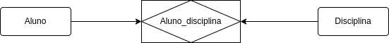

# Mapeando relacionamentos Muitos para Muitos (`@ManyToMany`)

As ferramentas de banco de dados relacionais e linguagens de programação orientadas a objeto tem um proposito comum, representar situações reais de um determinado modelo de negocio e automatizar ações que fazem parte deste contexto, seja apartir de outra ação ou de uma condição especifica. 

Quando observamos a natureza de um negocios somos capazes de perceber que existem relações claras entre os papeis distintos que juntos resolvem algum problema. Dentro de um contexto escolar existem diversos papeis como Aluno, Professor e Disciplina. 

Um aluno no decorrer de sua vida escolar, participa de varias disciplinas e uma disciplina é feitas por muitos alunos. Quando existem muitas ocorrências de um relacionamento entre uma entidade A e para uma entidade B é o que chamamos de relacionamento de cardinalidade Um para Muitos (`1:N`), porém se existerem muitas ocorrências de um relacionamento da entidade B para entidade A, caracterizando o mesmo relacionamento de ambos lados, formamos um relacionamento de Muitos para Muitos (`N:N`).

Os relacionamentos com cardinalidade `Muitos para Muitos` tem como caracteristica a criação de uma tabela associativa, ou seja, é feito uma tabela que agrupa as incidencias de uma chave primaria de Aluno para um chave primaria de Disciplina.



Outra caracteristica interessante sobre relacionamentos `Muitos para Muitos` é que não existe uma relação de dominancia, ou seja, para que um registro da entidade B exista, não é necessário que exista uma registro da entidade A.  No nosso exemplo, podemos dizer que para que exista a disciplina Matematica não é necessário que exista um aluno.

## Mapeando Relacionamentos `Muitos para Muitos` com JPA e Hibernate
 
 Agora iremos explorar como realizar o mapeando em nivel de objeto, e praticas que ajudam a manter uma boa performance.

Veja abaixo o mapeamento das entidades Aluno e Disciplina:

```java
@Entity
public class Aluno{
    @Id
    @GeneratedValue(strategy=IDENTITY)
    private Long id;

    private String nome;
    private String endereco;
    private LocalDate dataNascimento;
    private LocalDate dataMatricula;

    public Aluno(String nome, String endereco,LocalDate dataNascimento,LocalDate dataMatricula){
        this.nome=nome;
        this.endereco=endereco;
        this.dataNascimento=dataNascimento;
        this.dataMatricula=dataMatricula;
    }

    /**
     * @deprecated construtor para uso exclusivo do hibernate
     */
    @Deprecated
    public Pessoa(){

    }
}

```

```java
@Entity
public class Disciplina{
    @Id
    @GeneratedValue(strategy=IDENTITY)
    private Long id;

    private String titulo;

    private Integer duracaoEmHoras;

    @Lob
    private String ementa;
    private LocalDateTime criadoEm=LocalDateTime.now();

    public Disciplina(String titulo, Integer duracaoEmHoras, String ementa){
        this.titulo=titulo;
        this.duracaoEmHoras=duracaoEmHoras;
        this.ementa=ementa;
    }

    /**
     * @deprecated construtor para uso exclusivo do hibernate
     */
    @Deprecated
    public Disciplina(){

    }
}
```
O proximo passo é mapear a entidade associativa que é criada em um relacionamento muitos para muitos. Vamos precisar conhecer as seguintes anotações:

- `@ManyToMany` : Anotação responsavel por definir a cardinalidade do relacionamento, ou seja, através dela que o Hibernate identificara que é usado uma tabela intermediaria para agrupar as informações de uma relação.
- `@JoinTable`: Anotação responsavel por identificar informações sobre a entidade associativa, como nome, quais são os atributos que forma a relação, e até mapear indices.
- `@JoinColumn`: Anotação responsavel por definir quais são as colunas ou atributos que foram a relação.

Observe agora o mapeamento da relação nas entidades

```java
@Entity
public class Aluno{
    @Id
    @GeneratedValue(strategy=IDENTITY)
    private Long id;

    private String nome;
    private String endereco;
    private LocalDate dataNascimento;
    private LocalDate dataMatricula;


    @JoinColumn(name="aluno_disciplina",
        joinColumns = @JoinColumn(name = "aluno_id"),
        inverseJoinColumns = @JoinColumn(name = "disciplina_id")
    )
    @ManyToMany(cascade= {
        CascadeType.PERSIST,
        CascadeType.MERGE
    })
    private List<Disciplina> disciplinas= new ArrayList<>();

    public Aluno(String nome, String endereco,LocalDate dataNascimento,LocalDate dataMatricula){
        this.nome=nome;
        this.endereco=endereco;
        this.dataNascimento=dataNascimento;
        this.dataMatricula=dataMatricula;
    }

    /**
     * @deprecated construtor para uso exclusivo do hibernate
     */
    @Deprecated
    public Pessoa(){

    }
}
```

```java
@Entity
public class Disciplina{
    @Id
    @GeneratedValue(strategy=IDENTITY)
    private Long id;

    private String titulo;

    private Integer duracaoEmHoras;

    @Lob
    private String ementa;
    private LocalDateTime criadoEm=LocalDateTime.now();

    @ManyToMany(mappedBy="disciplinas")
    private List<Aluno> alunos= new ArrayList<>();

    public Disciplina(String titulo, Integer duracaoEmHoras, String ementa){
        this.titulo=titulo;
        this.duracaoEmHoras=duracaoEmHoras;
        this.ementa=ementa;
    }

    /**
     * @deprecated construtor para uso exclusivo do hibernate
     */
    @Deprecated
    public Disciplina(){

    }
}
```

Muitos desenvolvedores considerariam o trabalho feito e o mapeamento terminado, porém este mapeamendo reflete um problema em performance no momento em que é feito uma remoção de disciplina para um aluno. Quando usamos um objeto do tipo `List` para mapear relacionamentos Muitos para Muitos, o Hibernate entende que é necessário remover todos registros do relacionamento e re-inserir apenas os que não foram solicitado a sua remoção. Do ponto de vista do Banco de Dados é feito N novos insertes e associações de chaves primarias a estas tabelas.

### Então qual é a maneira mais eficiente de Mapear estes relacionamentos?

Substituindo a Collection `List` para `Set` sera reduzido as operações de remoção para apenas entidade que contém o identificador informado. Iremos também cuidar de sincronizar os eventos de relação entre as duas entidades através da criação de metodos. Observe o mapeamento abaixo.


```java
@Entity
public class Aluno{
    @Id
    @GeneratedValue(strategy=IDENTITY)
    private Long id;
    // demais atributos otimitos


    @JoinColumn(name="aluno_disciplina",
        joinColumns = @JoinColumn(name = "aluno_id"),
        inverseJoinColumns = @JoinColumn(name = "disciplina_id")
    )
    @ManyToMany(cascade= {
        CascadeType.PERSIST,
        CascadeType.MERGE
    })
    private Set<Disciplina> disciplinas= new HashSet<>();

    // construtores otimidos

    public void adicionar(Disciplina disciplina){
        this.disciplinas.add(disciplina);
        disciplina.adicionar(this);
    }
    
    public void remover(Disciplina disciplina){
        this.disciplinas.remove(disciplina);
        disciplina.remover(this);
    }
}
```

```java
@Entity
public class Disciplina{
    @Id
    @GeneratedValue(strategy=IDENTITY)
    private Long id;
    // demais atributos omitidos
    @ManyToMany(mappedBy="disciplinas")
    private Set<Aluno> alunos= new HashSet<>();

    //construtores omitidos

    public void adicionar(Aluno aluno){
        this.alunos.add(aluno);
    }
    
    public void remover(Aluno aluno){
      this.alunos.remove(aluno);
    }
}
```

## Link para aprofundamento
- [Melhor maneira de mapear o relacionamento JPA e Hibernate ManyToMany](https://vladmihalcea.com/the-best-way-to-use-the-manytomany-annotation-with-jpa-and-hibernate/)
- [Como sincronizar associações de entidades bidirecionais com JPA e Hibernate](https://vladmihalcea.com/jpa-hibernate-synchronize-bidirectional-entity-associations/)
- [Como sincronizar associações de entidades bidirecionais com JPA e Hibernate](https://vladmihalcea.com/a-beginners-guide-to-jpa-hibernate-entity-state-transitions/)


