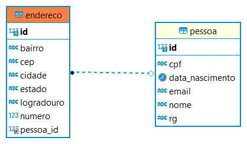

# Mapeando Relacionamentos Muitos para Um Com Jpa/Hibernate

A programação orientada a objetos nós permite mapear em objetos entidades de um dominio de negocio, estas entidades podem se relacionam com outras. Um modelo simples pode ter relacionamentos desde Um para Muitos (1:N), Muitos para Um (M:1), e até Muitos para Muitos(N:N). Como estes modelos são representados em banco de dados relacionais é esperado que existam tabelas que carregem a chave estrageira referente a outras tabelas, e também tabelas intermetiarias que carregam chaves primarias que representem um relacionamento entre duas entidades. 

## Mapeando relacionamento Muitos para Um (ManyToOne)

Caso você não recorde como é feito um mapeamento simples recomendamos que leia este [artigo](https://github.com/zup-academy/materiais-publicos-treinamentos/blob/main/crud-basico-com-java-hibernate/mapeamento-objeto-relacional.md) antes de prosseguir.

Hoje em dia é bastante popular que os sistemas agrupem diversos endereços de seus usuarios, em caso de comercios isso possibilita que um cliente receba compras em qualquer lugar da Cidade, Estado ou País. 

Uma modelagem de dados eficiente conteria duas tabelas, uma para representaras as Pessoa,  e outra para representar os Endereços. Dado que  um endereço não é compartilhado por mais de uma Pessoa, é interessante que a tabela de Endereco tenha uma chave estrageira que faça referencia a chave primaria da tabela Pessoa. Esta representação garantirá que para cada registro de endereço pertença a um registro de pessoa. Para melhor entendimento observe a figura abaixo.

<p align="center">

</p>


### Mapeamento Many to One na pratica. 

Dado que um Endereço só existe caso houver um cadastro de uma Pessoa, é caracterizado um uma relação de dominancia, onde o Endereço é a entidade subordinada e a Pessoa é a entidade Dominanate. A relação de dominancia implica que se uma Pessoa for excluida os endereços dela também devem ser excluidos. 

A Jpa oferece a anotação @ManyToOne para mapear relacionamentos Muitos para Um, e veremos abaixo como utiliza-la.


```java
@Entity
public class Pessoa {
    @Id
    @GeneratedValue(strategy = GenerationType.IDENTITY)
    private Long id;
    private String nome;
    private String cpf;
    private String email;
    private String rg;
    private LocalDate dataNascimento;

    public Pessoa(String nome, String cpf, String email, String rg, LocalDate dataNascimento) {
        this.nome = nome;
        this.cpf = cpf;
        this.email = email;
        this.rg = rg;
        this.dataNascimento = dataNascimento;
    }

    /**
    * @deprecated construtor para uso exclusivo do hibernate
    */
    @Deprecated
    public Pessoa(){

    }
}
```

Após o mapeamento da entidade dominante, devemos mapear a entidade subordinada.


```java
@Entity
public class Endereco {
    @Id
    @GeneratedValue(strategy = GenerationType.IDENTITY)
    private Long id;
    private String logradouro;
    private Integer numero;
    private String bairro;
    private String cidade;
    private String estado;
    private String cep;
    @ManyToOne
    private Pessoa pessoa;

    public Endereco(String logradouro, Integer numero, String bairro, String cidade, String estado, String cep) {
        this.logradouro = logradouro;
        this.numero = numero;
        this.bairro = bairro;
        this.cidade = cidade;
        this.estado = estado;
        this.cep = cep;
    }

    /**
     * @deprecated construtor para uso exclusivo do hibernate
     */
    @Deprecated
    public Endereco() {
    }
}
```

Ao observar a entidade Endereço, observamos que ela possui um Objeto do tipo Pessoa, que foi maepado como entidade, e sobre este objeto se encontra a anotação @ManyToOne. 

Neste artigo aprendemos que uma relação de muitos para é definida quando uma entidade carrega como chave estrangeira a chave primaria de outra entidade. Também aprendemos esta relação é uma dependencia de existencia, ou seja, que para uma entidade existir é necessário que outra exista previamente. Como a JPA/Hibernate mapeam as chaves primarias para Objetos em Memoria, e que em um relacionamento Muitos para Um, isto significa que uma classe que represente uma entidade, deve conter um objeto da classe que represente outra entidade previamente anotada com @ManyToOne.


