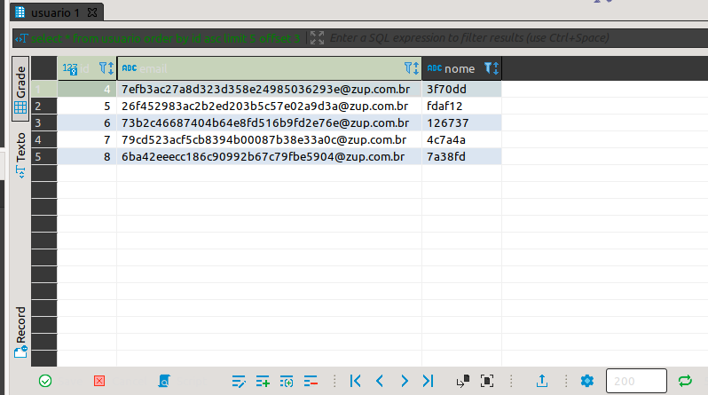

# Paginação de Consultas
 
 É muito comum que sistemas web e mobile exibam relatorios personalizados onde o cliente extrai informações para tomada de decisão dentro do fluxo do sistema ou fora. Dentro de Ecommerces encontramos determinadas paginas onde diversos produtos disponiveis para compra são exibidos, e no fim desta pagina quase sempre encontramos um indicador que permita navegar para outras paginas com mais produtos.
 
 Estas paginas são montadas através de informações que estão persistidas em um banco de dados e são obtidas através de consultas.

## O que é paginação

Ao realizar uma consulta em uma tabela existem algumas premissas que devemos nos atentar: quais campos iremos obter? desejamos mostrar todos os registros? os registros devem estar ordenados apartir de um campo?  a ordenação deve ser do menor para o maior ou da ordem contraria ?

As repostas para estas perguntas forma parte de um conceito chamado de `Paginação`, como o nome já diz, vem de paginar, dividir, estruturar. Recurso de paginação esta disposto não só em sistemas computacionais, mas também em sistemas fisicos como uma revista,livro e Agenda.

 Dividir uma coleçãode uma entidade em diversas paginas, com quantidade minima e maxima de recursos e ordenados apartir de um criterio e ordem, é o que definimos como paginação. 

## Qual é a importancia de utilizar

Determinar paginação nas consultas de seu sistema pode trazer algumas vantagens, quando analisamos pela visão de um usuario num aplicativo mobile ou de uma pagina da web podemos notar dois motivos bem relevantes, primeiro caso o usuario pecorra as paginas e encontre um objeto que o interesse, ele pode simplesmente anotar ou memorizar o numero da pagina e continuar a visitar as proximas paginas que posteriormente sera simples encontrar novamente seu objeto. O segundo motivo é que a experiência dentro da pagina é melhor quando ele não precisa divir sua atenção em uma pagina com excesso de informações.

Do ponto de vista do servidor back-end, podemos ter em mente que pode haver muitos registros de uma entidade, considerando casos de 6 a 7 milhões pode aumentar o tempo de resposta ao cliente, e causar uma cascata de solicitações para a mesma funcionalidade, proporcionando até mesmo um estouro de memoria. 

Outro ponto que deve ser levado em consideração é que não existe cliente, que seja capaz de observar e processar uma quantia alta de registros como esta, e será que o servidor tem memoria suficiente para trazer todos os registros? todos esses pontos nos dizem que retornar pequenas frações dos registros é uma boa escolha, agora vemos nos atentar em como fazer.

## Paginação Postgres

A paginação pode ser feita dentro dos Sistemas de Gerenciamentos de Banco de Dados `(SGBD)` através de operadores, para exemplificar vamos praticar paginação no  Postgres. 

Caso nosso objetivo seja trazer todos registros de uma tabela, provel que escreveriamos a sequinte query.

```sql
select id, nome, email
from usuario
order by id asc;
```

certamente obteriamos um resultado como  a imagem abaixo. Uma lista com todos registros quanto mais rolamos o scroll para baixo mais veremos mais registros.


<p align="center">

</p>

Olhando a imagem podemos notar o seguinte, os registros começam a ser exibidos apartir do id de valor 1,  e o tamanho da coleção não é determinado. 

E se apenas os 5 primeiros registros que são interessantes a partir do registro 4? De maneira simples podemos pensar vamos limitar a 5 registros,e vamos iniciar apos o registro 3.

Para definir estes criterios vamos conhecer  `limit` e `offset`. Vamos descrever qual é a responsabilidade de cada um.

- `limit`: definimos a quantidade de registros que vamos exibir.

- `offset`: defimos a partir de qual registro devemos iniciar a lista de registro.

Como vamos escrever agora nossa consulta com os recuros de paginação?

```sql 
select *
from usuario 
order by id asc
limit 5 offset 3;
```

E obtemos o nosso resultado, com registros apartir do id de valor quatro, com uma lista de 5 registros.

<p align="center">

</p>

## Paginação com Spring Data JPA

O Spring Data oferece já uma interface para gente lidar com paginações de maneira simples e direta, o `PagingAndSortingRepository` oferece suporte a ordenação e paginação. O legal a se notar é que a abstração da `JpaRepository` já estende estes  comportamentos então de maneira simples podemos continuar utilizando nossos repositorios sem mudar 1 caracter de codigo. 

O metodo  como `findAll` recebe o parâmetro do tipo `Pageable` que é uma abstração para informações sobre paginação como, numero de elementos numa pagina (`limit`), qual pagina deseja visualizar de inicio, qual o `offset`, e também um atributo do tipo `Sort` utilizado para determinar qual atributo sera utilizado ordenação e qual a direção crescente ou decrescente.

Veja o Seguinte exemplo, Existe a entidade Pessoa, e queremos exibir todos os registros da mesma, observe abaixo o mapeamento da Pessoa e do Repository.


```java
@Entity
public class Pessoa{
    @Id
    @GeneretedValue
    private Long id;

    private String nome;
    private String sobreNome;
    private String email; 
    
}

```

```java

public interface PessoaRepository extends JpaRepository<Pessoa,Long>{
 
}

```

Observe um componente definindo a paginação de uma consulta com metodo `findAll`

```java
@Service 
public class PessoaConsultaService {
    private final PessoaRepository repository;

    public PessoaConsultaService(PessoaRepository repository){
        this.repository=repository;
    }


    public void consultandoTodosPaginado(){
        Pageable pagination = PageRequest.of(0,5,Sort.by("id"));

        Page<Pessoa> repository.findAll(pagination);


    }
}

```

No codigo acima podemos notar algumas diferenças já, como por exemplo: 
- O retorno da consulta é um objeto do tipo `Page<T>`, este objeto encapsula a lista de todos registros, e também tem informações de quantos registros por paginas e a quantidade de paginas disponiveis.
- É criado uma instância para abstração `Pageable`, nesta instância são passados algumas informações como: a pagina inicial, a quante de registro por paginas, e por fim um objeto do tipo `Sort` contendo a entrada com valor "id".
- O objeto do tipo `Sort` é definir qual é o atributo que deve ser utilizado para ordenação, e qual é a ordem na ordenação, seja crescente ou decrescente, quando não é informado é utilizado 

### Posso criar minhas consultas e definir o retorno com paginação ou apenas ordenação?

Quando necessário podemos criar consultas e delegar a responsabilidade de criar a paginação e/ou ordenação através dos parâmetros da assinatura do metodo, veja o exemplo abaixo.

```
public interface PessoaRepository extends JpaRepository<Pessoa,Long>{
    
      //definindo uma consulta que retorna todos registros de pessoa que contenha uma string no nome, e também aceita um criterio para definir a paginacao
    Page<Pessoa> findByNomeContainsIs(String nome, Pageable page);
    
    //definindo uma consulta que retorna todos registros de pessoa que contenha uma string no nome, e também aceita um criterio de ordenacao por atributo e ordem.
    List<Pessoa> findByNomeContainsIs(String nome, Sort sort);
}

```


## Links para aprofundamento 

- [Paginação com Postgres](https://www.postgresql.org/docs/8.3/queries-limit.html)
- [Entendendo PageRequest](https://docs.spring.io/spring-data/commons/docs/current/api/org/springframework/data/domain/PageRequest.html)
- [Entendendo Page](https://docs.spring.io/spring-data/commons/docs/current/api/org/springframework/data/domain/Page.html)
- [Entendendo Pageable](https://docs.spring.io/spring-data/commons/docs/current/api/org/springframework/data/domain/Pageable.html)
- [Criando consultas paginadas com Spring Data](https://www.baeldung.com/spring-data-jpa-pagination-sorting)