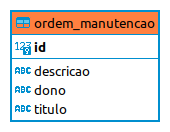
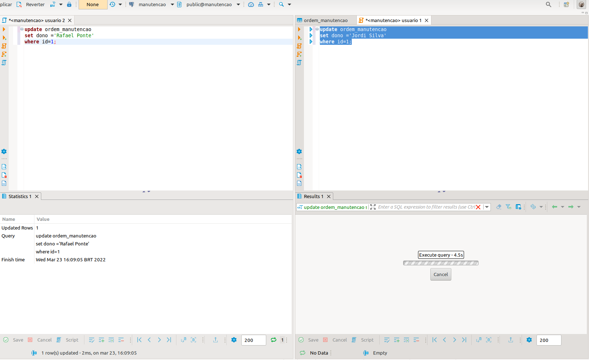
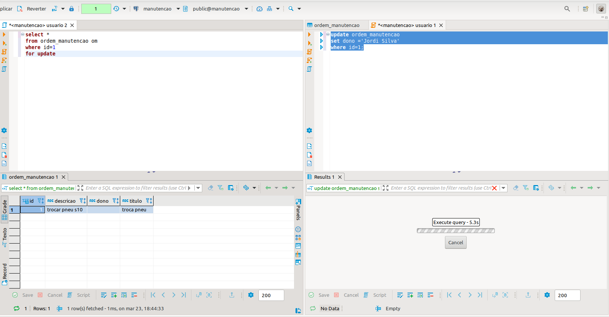

# Introdução a Bloqueio (Locking) Implicito e Explicito

Existem ambientes na qual encontra-se um alto nivel de disputa por um determinado recurso, sistemas de reservar de cadeiras de em um cinema, reserva de leitos em hospitais e salas de aulas em determinadas universidades  trazem uma dinâmica onde diversos usuarios optam por reservar o mesmo recurso.

Olhando para o sistema podemos lidar com esta concorrência a nivel de thread, porém, ficamos refens do mesmo problema caso seja necessário levantar uma nova instância do sistema em outra maquina. A solução para esta problematica é determinar um mecanismo para lidar com a concorrência destes sistemas distribuidos de maneira centralizada, e o primeiro sistema externo em comum é o Banco de Dados.

Por natureza os bancos de dados são implementados para lidar com alto volume de concorrência, dado que varias `Transactions` são executadas em uma unica unidade de tempo. 

## Como as Transactions lidam com atualizações ao mesmo registro?

Para que a integridade de determinado registro/linha seja mantida o banco de dados determina um tipo de bloqueio sobre o registro enquanto a transação não seja finalizada, independente do estado ser de commmit ou rollback.

### O que são esses bloqueios?

Imagine que exista uma tabela para armazenar as ordens de manutenção de uma oficina de uma fazenda, dentro dessas ordens seja necessário armazenar um titulo e uma descrição, e exista também um campo para inserir o nome de qual funcionario realizara esta ordem. Veja a representação abaixo.

<p align="center">

</p>


Esta tabela carrega uma ordem de manutenção com id com valor 1 referênte a troca de pneu da caminhonete S10. Todos funcionarios acessam através do aplicativo as ordens de manutenção, mas caso mais de um tentem atribuir a mesma ordem para si, como o banco de dados lida?


Para casos de atualização de um registro  ou seja a operação `Update`, é determinado uma trava, permitindo que apenas a transação atual possa escrever nesta linha. As demais transações devem aguardar a finalização da transação que contem a trava para possam fazer suas alterações. Este comportamento é o que chamamos de Bloqueio Exclusivo ou Bloqueio de Escrita.

### Entendendo o Bloqueio de Escrita

O bloqueio de escrita determina que outra transação aguarde até que a transação que obteve o bloqueio seja confirmada. Os bloqueios de escrita podem ser obtidos de duas formas Implicitamente ou Explicitamente.

- Bloqueio Exclusivo Implicito: É dado quando uma operação Update é disparada, automaticamente o banco insere um bloqueio junto aquela transação.

- Bloqueio Exclusivo Explicito: É quando determinamos manualmente que uma operação de leitura (Select) se comporte como uma Operação de atualização, bloqueando aquela linha até que a transação seja finalizada.


### Invocando um Bloqueio Implicito


Para visualizar a dinâmica basta abrir seu SGBD preferido e trocar o modo de transação de automatico para manual. Ou seja, agora você define quando é feito o Commit ou Rollback. 

Na imagem abaixo se encontrar duas Interface de Linhas de Comando (CLI), ambas com o mesmo comando de Update, atualizando o dono da ordem de manutenção, ambos para mesma linha.

Na primeira janela com nome de `Usuario 2` é executado o comando, neste momento é inserido um bloqueio implicito no registro da tabela ordem_manutencao com id igual a um. Na outra janela é pedido para fazer o mesmo comando porém a transação fica esperando, pois a transação do `Usuario 2` não foi commitada ou revertida.

Caso um comando de Consulta (Select) fosse disparado na janela com titulo `Usuario 1` seria possível realizar a leitura do registro, pois o bloqueio exclusivo trata define a permissão exclusiva para transação  na operação de escrita.




### Como invocamos um bloqueio explicitamente?

Existem situações que queremos ler determinado registro, executar um processamento de dados e por fim realizar uma escrita. Situações assim exigem que a integridade do dado seja a mesma enquanto o processamento esta sendo realizado, para isso precisamos travar o registro no momento da leitura. 

Para fazer com que a consulta defina um bloqueio explicito precisamo junto a consulta anexar os comandos `for update`.

```sql
    select * 
    from ordem_manutencao om 
    where id=1
    for update;
```

Observer na imagem a baixo o que acontece caso a janela com nome `Usuario 2` executa a instrução de Select com for update, e em seguida a janela com nome  `Usuario 1` tenta atualizar o registro.



Notamos que acontece o mesmo fluxo do que o comando `Update` ocasiona, ou seja, é dado um bloqueio explicito de escrita.

## Conclusão

O Bloqueio Exclusivo invocado de maneira implicita ou explicita são utéis em situações onde desejamos previnir conflitos, porém, devemos ter cuidado ao utiliza-los como definem que a outra `transaction` deve esperar, o aumento do tempo de resposta pode levar a gargalos a nivel da aplicação.

## Observação 

O SGBD utilizado foi o Dbeaver e o banco de dados foi um Postgres. Para melhor entidimento da mecânica dos bloqueio leia a documentação sugerida na sessão abaixo.

# Links para Aprofundamento
- [Select Postgres Documentação ](https://www.postgresql.org/docs/9.0/sql-select.html)
- [Update Postgres Documentação ](https://www.postgresql.org/docs/9.5/sql-update.html)
- [Cláusula For Update Postgres Documentação ](https://www.postgresql.org/docs/9.0/sql-select.html#SQL-FOR-UPDATE-SHARE)