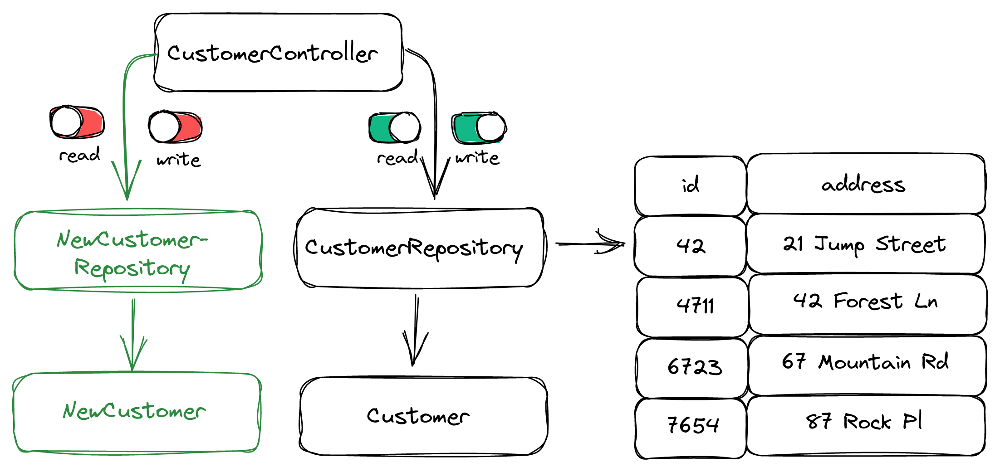
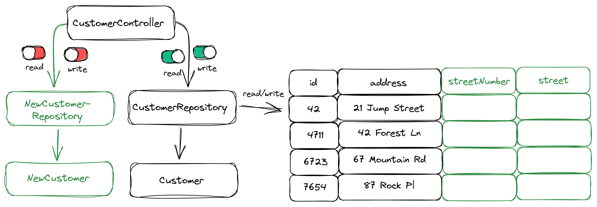
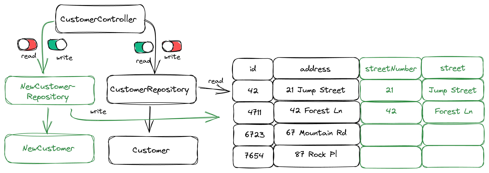
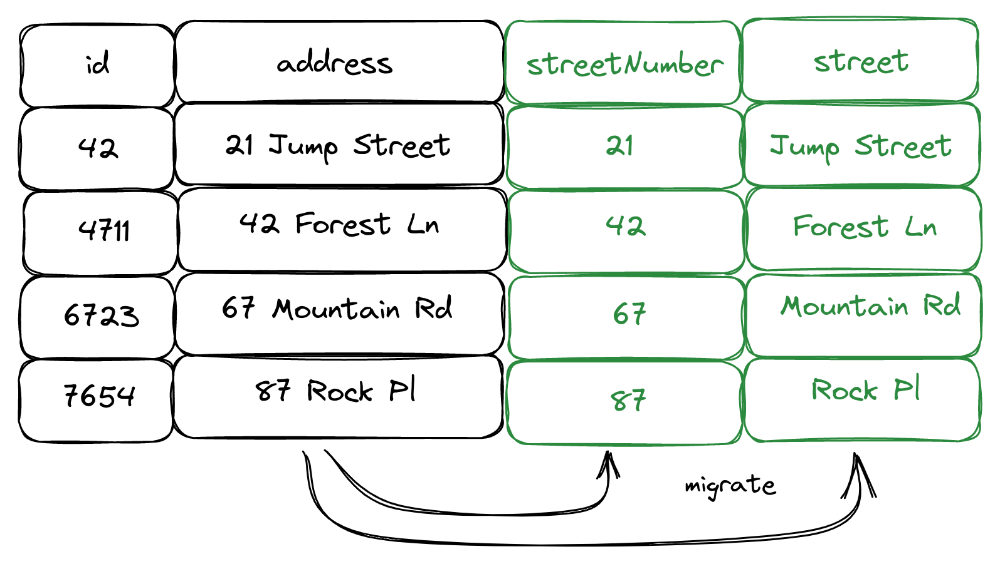
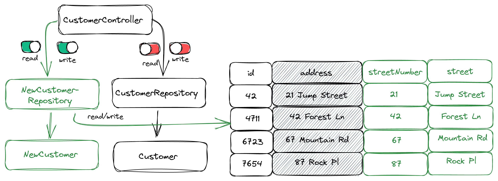

####Este material é uma tradução de um artigo existente, o link do artigo original é:
https://reflectoring.io/zero-downtime-deployments-with-feature-flags/

#Zero Downtime em alterações no banco de dados com feature flags.

Sempre que fazemos uma alteração em nosso esquema de banco de dados, também temos que fazer uma alteração no código que usa esse esquema de banco de dados.

Quando adicionamos uma nova coluna ao banco de dados, precisamos alterar o código para usar essa nova coluna.

Quando excluímos uma coluna do banco de dados, precisamos alterar o código para não usar mais aquela coluna.

Vamos analisar como podemos coordenar as alterações de código com as alterações do banco de dados e implantá-las em nosso ambiente de produção sem Downtime.

##O problema: coordenar as alterações do banco de dados com as alterações de código

Se liberarmos a alteração do banco de dados e a alteração do código ao mesmo tempo, dobramos o risco de que algo dê errado. Acoplamos o risco da alteração do banco de dados com o risco da alteração do código.

Normalmente, nosso aplicativo é executado em vários nós e, durante uma nova versão, o novo código é implantado em um nó por vez. Isso geralmente é chamado de “implantação contínua” ou “liberação round-robin” com o objetivo de zero Downtime. Durante a implantação, haverá nós em execução com o código antigo que não é compatível com o novo esquema de banco de dados. Como podemos lidar com isso?

O que fazemos quando a implantação da alteração de código falhou porque introduzimos um bug? Temos que reverter para a versão antiga do código. Mas a versão antiga do código pode não ser mais compatível com o banco de dados , pois já aplicamos a alteração do banco de dados! Portanto, temos que reverter a alteração do banco de dados também! A reversão em si traz algum risco de falha porque uma reversão geralmente não é uma atividade bem planejada e bem ensaiada. Como podemos melhorar esta situação?

A resposta a essas perguntas é desacoplar as alterações do banco de dados das alterações de código usando feature flags .

Com feature flags, podemos implantar alterações e códigos de banco de dados a qualquer momento e ativá-los a qualquer momento após a implantação.

Este tutorial fornece um guia passo a passo sobre como liberar alterações de banco de dados e as alterações de código correspondentes com segurança e sem tempo de inatividade usando Spring Boot, Flyway e feature flags implementados com uma plataforma de feature flags como LaunchDarkly .

##Exemplo de caso de uso: dividir uma coluna de banco de dados em duas

Como caso de uso de exemplo, vamos dividir uma coluna de banco de dados em duas.
Inicialmente, nosso aplicativo se parece com isso:

<p align="center">

</p>

Temos um CustomerController que fornece uma API REST para nossas entidades CUSTOMER. Ele usa o CustomerRepository, que é um repositório Spring Data que mapeia entradas na CUSTOMER tabela de banco de dados para objetos do tipo Customer. A CUSTOMER tabela tem as colunas ID e ADDRESS para o nosso exemplo.

A coluna ADDRESS contém o nome da rua e o número da rua no mesmo campo. Imagine que devido a alguns novos requisitos, tenhamos que dividir a ADDRESS coluna em duas colunas: STREETNUMBER e STREET.

No final, queremos que o aplicativo fique assim:

<p align="center">

</p>

Neste guia, veremos todas as alterações que precisamos fazer no banco de dados e no código e como liberá-las da forma mais segura possível usando sinalizadores de recursos e várias implantações.

###Etapa 1: desacoplar alterações de banco de dados de alterações de código

Antes mesmo de começarmos a alterar o código ou o esquema do banco de dados, queremos desacoplar a execução das alterações do banco de dados da implantação de um aplicativo Spring Boot.

Por padrão, o Flyway executa a migração do banco de dados na inicialização do aplicativo. Isso é muito conveniente, mas nos dá pouco controle. E se a alteração do banco de dados for incompatível com o código antigo? Durante a implantação contínua, pode haver nós com os códigos antigos ainda usando o banco de dados!

Queremos controle total quando executamos as alterações de esquema de banco de dados! Com um pequeno ajuste no nosso aplicativo Spring Boot, podemos conseguir isso.

Primeiro, desabilitamos o padrão do Flyway para executar migrações de banco de dados na inicialização:

```java
@Configuration
class FlywayConfiguration {

    private final static Logger logger = LoggerFactory.getLogger(FlywayConfiguration.class);

    @Bean
    FlywayMigrationStrategy flywayStrategy() {
        return flyway -> logger.info("Flyway migration on startup is disabled! Call the endpoint /flywayMigrate instead.");
    }
}
``` 
Em vez de executar todas as migrações de banco de dados que ainda não foram executadas, ele agora apenas imprimirá uma linha no log dizendo que devemos chamar um endpoint HTTP.
Mas também temos que implementar este endpoint HTTP:

```java
@RestController
class FlywayController {

    private final Flyway flyway;

    public FlywayController(Flyway flyway) {
        this.flyway = flyway;
    }

    @PostMapping("/flywayMigrate")
    String flywayMigrate() {
        flyway.migrate();
        return "success";
    }

}
```
Sempre que chamarmos /flywayMigrate via HTTP POST agora, o Flyway executará todos os scripts de migração que ainda não foram executados. Observe que você deve proteger esse endpoint no aplicativo real, para que nem todos possam chamá-lo.
Com essa alteração, podemos implantar uma nova versão do código sem sermos forçados a alterar o esquema do banco de dados ao mesmo tempo. Faremos uso disso na próxima etapa.

###Etapa 2: implantar o novo código por trás de um sinalizador de recurso

Em seguida, escrevemos o código que precisamos para trabalhar com o novo esquema de banco de dados:

<p align="center">

</p>

Como vamos alterar a estrutura da tabela CUSTOMER, criamos a classe NewCustomer que mapeia para as novas colunas da tabela (ou seja, streetNumber e street em vez de apenas address). Também criamos NewCustomerRepository como um novo repositório Spring Data que se vincula à mesma tabela, CustomerRepositorymas usa a NewCustomerclasse para mapear linhas de banco de dados em Java.
Observe que implantamos o novo código, mas ainda não o ativamos. Ainda não pode funcionar, porque o banco de dados ainda está no estado antigo.
Em vez disso, nós escondemos atrás de feature flags. No CustomerController agora temos um código que se parece com isso:

```java
@PostMapping("/customers/create")
String createCustomer() {
  if (featureFlagService.writeToNewCustomerSchema()) {
      NewCustomer customer = new NewCustomer("Bob", "Builder", "Build Street", "21");
      newCustomerRepository.save(customer);
  } else {
      OldCustomer customer = new OldCustomer("Bob", "Builder", "21 Build Street");
      oldCustomerRepository.save(customer);
  }
  return "customer created";
}

@GetMapping("/customers/{id}}")
String getCustomer(@PathVariable("id") Long id) {
  if (featureFlagService.readFromNewCustomerSchema()) {
    Optional<NewCustomer> customer = newCustomerRepository.findById(id);
    return customer.get().toString();
  } else {
    Optional<OldCustomer> customer = oldCustomerRepository.findById(id);
    return customer.get().toString();
  }
}
``` 
Com uma ferramenta de sinalização de recursos como LaunchDarkly , criamos dois sinalizadores de recursos:

O sinalizador booleano featureFlagService.writeToNewCustomerSchema() define se o caminho de gravação para o novo esquema de banco de dados está ativo. Esta feature flag ainda está desabilitada porque ainda não atualizamos o esquema do banco de dados.

O sinalizador booleano featureFlagService.readFromNewCustomerSchema() define se o caminho de leitura do novo esquema de banco de dados está ativo. Esta feature flag também está desabilitada por enquanto.

Com a ajuda de feature flags, implantamos o novo código ainda sem tocar no banco de dados, o que faremos na próxima etapa.

###Etapa 3: adicionar as novas colunas do banco de dados

Com a implantação do novo código na etapa anterior, também implantamos um novo script SQL para o Flyway executar. Após a implantação bem-sucedida, agora podemos chamar o /flywayMigrateendpoint que preparamos na etapa 1. Isso executará o script SQL e atualizará o esquema do banco de dados com os campos novos streetNumber e street.

<p align="center">

</p>

Essas novas colunas estarão vazias por enquanto. Observe que mantivemos a coluna address existente intocada por enquanto. No estado final, desejaremos remover esta coluna, mas primeiro temos que migrar os dados para as novas colunas.

As feature flags ainda estão desabilitadas por enquanto, de modo que tanto as leituras quanto as gravações vão para a coluna address do banco de dados antigo.

###Etapa 4: ativar gravações nas novas colunas do banco de dados

Em seguida, ativamos o writeToNewCustomerSchema feature flag para que o aplicativo agora grave nas novas colunas do banco de dados, mas ainda leia da antiga:

<p align="center">

</p>

Toda vez que o aplicativo agora grava um novo CUSTOMER no banco de dados, ele usa o novo código. Observe que o novo código ainda preencherá a coluna address antiga além das novas colunas streetNumber e street para compatibilidade com versões anteriores porque o código antigo ainda é responsável pela leitura do banco de dados.

Ainda não podemos mudar o novo código para ler dados do banco de dados, porque as novas colunas estarão vazias para a maioria dos registros na tabela CUSTOMER. As novas colunas serão preenchidas lentamente ao longo do tempo à medida que o novo código estiver sendo usado para gravar dados no banco de dados.

Para preencher as novas colunas para todos os clientes, precisamos executar uma migração.

###Etapa 5: migrar dados para as novas colunas do banco de dados

Em seguida, vamos executar uma migração que passa por todos os resgistros no banco de dados cujos campos streetNumber e street ainda estão vazios, lê o campo address e o migra para os novos campos:

<p align="center">

</p>

Essa migração pode ser um script SQL, algum código personalizado ou pessoas reais analisando os dados do CUSTOMER um por um e fazendo a migração manualmente. Depende do caso de uso, da qualidade dos dados e da complexidade da tarefa de migração para decidir o melhor caminho.

##Migrações de dados com Flyway?

Observe que o tipo de migração sobre o qual estamos falando nesta seção geralmente não é uma tarefa para o Flyway. Flyway é para executar scripts que migram o esquema de banco de dados de um estado para outro. Migrar dados é uma tarefa muito diferente.

Sim, o Flyway pode ser usado para migrar dados. Afinal, uma migração de dados pode muito bem ser apenas um script SQL. No entanto, uma migração de dados pode causar problemas como consultas de longa duração e bloqueios de tabela, o que não deve acontecer no contexto de uma migração Flyway porque temos pouco controle sobre isso.

###Etapa 6: ativar as leituras das novas colunas do banco de dados

Agora que todos os dados do cliente foram migrados para a nova estrutura de dados, podemos ativar a feature flag para usar o novo código para ler do banco de dados:

<p align="center">

</p>

O novo código agora está sendo usado para escrever e ler do banco de dados. O código antigo e a coluna address do banco de dados antigo não são mais usados.

###Etapa 7: remover o código antigo e a coluna do banco de dados

O último passo é limpar:

<p align="center">

</p>

Podemos remover o código antigo que não é mais usado. E podemos executar outra migração do Flyway que remove a coluna address antiga do banco de dados.

Também devemos remover as feature flag do código agora porque não estamos mais usando o código antigo. Se não removermos o código antigo, acumularemos dívidas técnicas que tornarão o código mais difícil de entender para a próxima pessoa. Ao usar feature flags em escala em toda a organização, uma plataforma de sinalização de recursos como o LaunchDarkly pode ajudar nisso, pois está rastreando o uso de feature flags em toda a base de código.

Agora também podemos renomear o NewCustomerRepository para CustomerRepository e NewCustomer para Customer, tornando assim o código limpo e compreensível mais uma vez.

##Implante com confiança

As 7 etapas acima serão distribuídas em várias implantações do aplicativo. Alguns deles podem ser combinados em uma única implantação, mas haverá pelo menos duas implantações: uma para implantar o novo código e os sinalizadores de recurso e outra para remover o código antigo e os sinalizadores de recurso.

Os sinalizadores de recursos nos dão muita flexibilidade e confiança nas alterações do banco de dados, como no caso de uso que discutimos acima. As feature flags nos permitem dissociar as alterações de código das alterações do banco de dados. Sem sinalizadores de recursos, só podemos ativar o novo código implantando uma nova versão do aplicativo, o que torna os cenários que exigem compatibilidade com versões anteriores com um esquema de banco de dados antigo muito mais difícil de gerenciar (e mais arriscado!).

Existem multiplas ferramentas de gerenciamento de feature flags, a citada no artigo foi LaunchDarkly, que é bem popular no mundo JVM.
