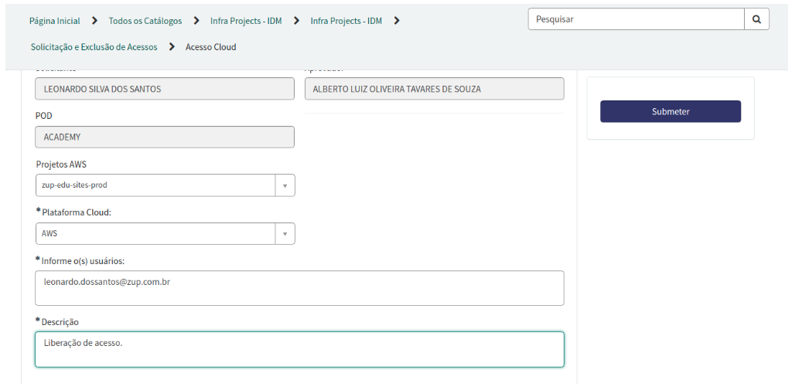

# acesso aws

Para acessar a aws é preciso ter um usuário, a solicitação pode ser feita [aqui](https://zup.service-now.com/sp?id=sc_cat_item&sys_id=9e7950db1ba53810cd8bda8fe54bcbc4&sysparm_category=a62073831b653810cd8bda8fe54bcb5c)

O projeto que handora reside é o zup-edu-sites-prod.

Em Plataforma Cloud, selecione aws.

Em Informe o(s) usuários, insira o(s) usuário(s) assim como uma descrição da solicitação.

Clique em Submeter

Ao final, o formulário ficará mais ou menos assim:

