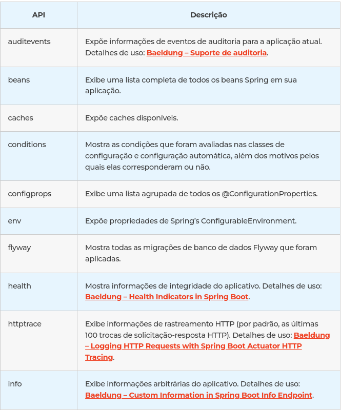
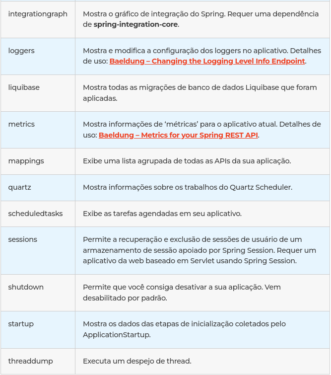

Arquivo Original : https://www.zup.com.br/blog/spring-actuator 

## Afinal, o que é Spring Actuator?
Antes de começarmos a falar sobre o que é o Spring Actuator, vamos falar sobre o significado de Actuator.

Actuator para quem não conhece é um dispositivo mecânico capaz de movimentar ou controlar alguma coisa. Quando recebe um sinal de controle, um Actuator responde convertendo a energia da fonte em um movimento mecânico.

Agora que já sabemos um pouco sobre o que é um Actuator, já devemos conseguir imaginar o que é o Spring Actuator, certo?

O Spring Actuator irá nos fornecer todos os recursos necessários para que possamos monitorar e gerenciar a nossa aplicação. Abaixo iremos mostrar como é feita a configuração para o uso e suas principais funcionalidades.


## Como configurar o Spring Actuator?
A configuração do Spring Actuator é bem simples. Para que possamos utilizá-lo em nossa aplicação, basta adicionar a sua dependência.

Maven:
```xml
<dependency>
<groupId>org.springframework.boot</groupId>
<artifactId>spring-boot-starter-actuator</artifactId>
</dependency>
```
Gradle:

```groovy
dependencies {
implementation 'org.springframework.boot:spring-boot-starter-actuator'
}
```
Pronto, feito isso estamos preparados para utilizar o Spring Actuator.

## Funcionalidades do Spring Actuator e como ela nos auxilia

Abaixo iremos ver uma lista de todos os endpoints disponíveis pelo Spring Actuator e uma breve descrição sobre cada um deles:

<p align="center">

</p>
<p align="center">

</p>

## Com grandes poderes, grandes responsabilidades

Como você pode ter visto, o Spring Actuator nos fornece um grande poder sobre a nossa aplicação, mas lembre-se: “Com grandes poderes, vem grandes responsabilidades” e por isso temos que ter o máximo de cuidado possível.

Por padrão temos apenas duas APIs que são expostas ao realizarmos a configuração do Spring Actuator na nossa aplicação, que seria o “info” e o “health”.

Eu particularmente nunca vi nenhuma aplicação que precisou expor todos os endpoints do Spring Actuator, cada funcionalidade depende do contexto da sua aplicação, então irei mostrar para vocês como expor para que possa saber o que, de fato, é necessário para a sua aplicação.

Usos mais comuns: Beans, Caches, Info, Health, Loggers, Metrics, Mappings, HttpTrace.

## Necessário, somente o necessário

Como já dizia a música do Mogli, o menino lobo: “Necessário, eu uso somente o necessário”.

Agora iremos te mostrar como expor os endpoints para que você possa realizar o consumo através de uma requisição WEB. Para isso, basta inserirmos a seguinte linha no nosso <b>application.properties:</b>

#### Para expor todos os endpoints:
```properties
management.endpoints.web.exposure.include=*
```
<b>Agora, para expor somente o necessário:</b>
```properties
management.endpoints.web.exposure.include=health, info, mappings, ….
```
Além disso, da mesma forma que a gente consegue expor via WEB, também conseguimos parar de expor. Para isso basta adicionar a seguinte linha no nosso <b>application.properties:</b>

#### Para não expor todos os endpoints:
```properties
management.endpoints.web.exposure.exclude=*
```
<b>Já para não expor somente o necessário:</b>
```properties
management.endpoints.web.exposure.exclude=health, info, mappings, ….
```
Um outro ponto que vale ser citado, é que além dos endpoints estarem expostos, eles também precisam estar ativados.

Por padrão todos os endpoints vêm ativados, com exceção do <b>shutdown</b> (que é perigoso, mas pode te ajudar em alguns momentos extremamente críticos). Para que possamos habilitar ele, por exemplo, basta adicionar a seguinte linha no nosso <b>application.properties:</b>
```properties
management.endpoint.shutdown.enabled=true
```

Caso você queira que todos os endpoints não venham habilitados por default, você pode adicionar a seguinte linha:
```properties
management.endpoints.enabled-by-default=false
```

E adicione aos poucos, como é visto no comando abaixo:
```properties
management.endpoint.<API>.enabled=true
```
O <b>Spring Actuator</b> nos dá uma autonomia muito grande na nossa aplicação e dessa forma a gente consegue configurar ao nosso gosto. 🙂

Mas como falamos antes, vamos ficar de olho na segurança! Como diz um dos pilares da ZUP. <b>#SomosGuardioes</b>

## De olho na segurança

Após falarmos de todos os pontos felizes e vermos o poder que o <b>Spring Actuator</b> nos fornece, chegou o momento de abordar sobre segurança ao expor as informações da nossa aplicação!

Uma das formas recomendadas pelo Spring para realizar a segurança das requisições dos nossos endpoints seria utilizar o <b>Spring Security</b>. Não vou entrar em muitos detalhes porque ele não é o foco do nossa conversa, mas abaixo veremos um exemplo do seu uso:
```java
@Configuration
@EnableWebSecurity
@EnableGlobalMethodSecurity(securedEnabled = true, prePostEnabled = true)
public class MySecurityConfiguration extends WebSecurityConfigurerAdapter {
   @Override
   protected void configure(HttpSecurity http) throws Exception {
     http
       .sessionManagement()
       .sessionCreationPolicy(SessionCreationPolicy.NEVER)
       .and()
         .authorizeRequests()
         .antMatchers("/actuator/").hasAuthority("ROLE_ADMIN")
         .anyRequest().authenticated()
      .and()
        .csrf().disable();
   }
}
```
No bloco de código acima, a gente deu permissão para que somente usuários que tem a <b>ROLE_ADMIN</b> consigam fazer chamadas nos endpoints referentes ao Spring Actuator. Essa é uma das formas mais abordadas pelo Spring para que possamos proteger as nossas APIs.

Uma outra forma interessante da gente proteger as nossas rotas do Spring Actuator seria mudar as configurações padrões. A seguir iremos ver alguns comandos bem interessantes para isso.

<b>Mudando o base-path padrão:</b>
```properties
management.endpoints.web.base-path=/portal-admin
```
Adicionando a linha acima no nosso application.properties a gente mudou a nossa API de /actuator para /portal-admin. Dessa forma, ficará mais difícil da pessoa que está querendo acessar a nossa aplicação, encontrar qual será a rota padrão.

<b>Use outra porta:</b>
```properties
management.server.port=1996
```
Adicionado a linha acima no nosso application.properties a gente muda qual será a porta padrão que o Spring Actuator irá executar, separando o mesmo até da nossa própria aplicação.

Além desses pontos de segurança que aplicamos, lembre-se também de expor somente o necessário para o gerenciamento da sua aplicação.
