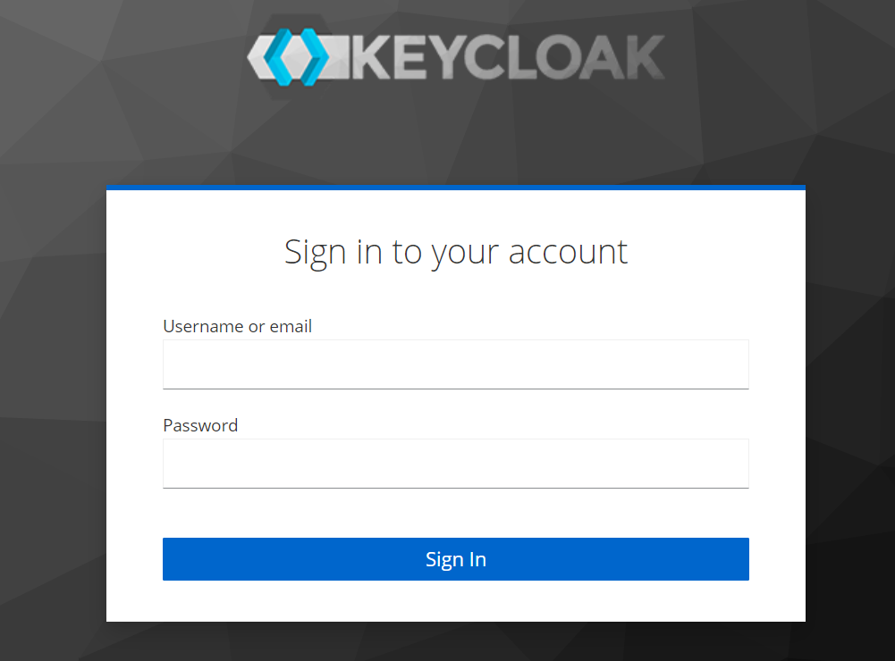

# Instalando e rodando Keycloak via Docker-Compose

Nesse conteúdo veremos como podemos instalar e rodar o Keyclock em nossas máquinas através do Docker-Compose, dessa forma poderemos configura-lo e usa-lo durante o desenvolvimento de aplicações localmente, sem a necessidade de um servidor externo ou internet.

## Entendendo as diferentes versões

Como sabemos, para trabalharmos com OAuth2 precisamos de um Authorization Server, e durante todo o treinamento usaremos o Keycloak para isso. Ao pensar em baixar o Keycloak, podemos baixo-lo, instala-lo e rodá-lo de 2 maneiras diferentes: stand-alone ou imagem de container. Durante o treinamento favoreceremos a o Keycloak via container Docker.

Ao pensar em utilizar o Keycloak via Docker, é interessante sabermos que atualmente existem 2 versões:

1. **Latest**: utiliza o framework de desenvolvimento Quarkus, que está mais aderente ao modelo de containers, traz melhor tempo de startup, menor consumo de memoria e maior throughput. Desde o Keycloak 17.x ela se tornou a versão default e oficial;
    - Em imagens Docker, identificamos com `quay.io/keycloak/keycloak:`**`latest`** ou simplesmente `quay.io/keycloak/keycloak`;
    - Qualquer versão do Keycloak a partir da 17.x;
2. **Legacy**: utiliza Wildfly como servidor de aplicação e plataforma de desenvolvimento. Esta versão será descontinuada em Junho de 2022, por esse motivo recomenda-se a migração para a versão Latest;
    - Em imagens Docker, identificamos com `quay.io/keycloak/keycloak:`**`legacy`**;
    - Se preferir, você pode usar a imagem mantida pela jBoss na [Docker Hub](https://hub.docker.com/r/jboss/keycloak): `jboss/keycloak`;
    - Qualquer versão do Keycloak **anterior** a 17.x;

Ambas funcionam muito bem, e no geral não importa muito qual delas usamos em tempo de desenvolvimento, ou seja, rodando localmente. Talvez a decisão mais importante esteja em qual delas devemos manter em produção dado que a versão Legacy será mantida de fato somente até Junho de 2022, mas este tipo de decisão foge do escopo deste treinamento.

Ambas as imagens rodam com diversos bancos de dados, como MySQL, PostgreSQL, Oracle, MSSQL Server, H2 etc.

Durante o treinamento usaremos a versão Quarkus com H2 pois ela é suficiente para ambiente de desenvolvimento e testes. De qualquer forma, iremos demonstrar como podemos rodar ambas as versões via Docker e Docker-Compose neste material teorico.

## Direto ao ponto 

A forma mais simples de rodar o Keycloak é via container Docker. Portanto, para baixar e instalar o container do Keycloak, basta seguir os passos abaixo:

1. Rode o comando Docker abaixo:
    ```sh
    docker run --name keycloak -p 18080:8080 \
      -e KEYCLOAK_ADMIN=admin -e KEYCLOAK_ADMIN_PASSWORD=admin \
      -e DB_VENDOR=h2 -d \
      quay.io/keycloak/keycloak:latest \
      start-dev
    ```
2. No seu browser, acesse o Admin Console via endereço: http://localhost:18080/admin/;
3. Por fim, faça o login com o usuário `admin` e senha `admin`;

Pronto! Você já pode configurar seu Keycloak!! Caso queira entender outras alternativas como Docker-Compose, detalhes para evitar conflitos de portas, ou mesmo rodar a versão Legacy, basta continar lendo esse conteúdo.

## Instalando e rodando o Keycloak (Latest/Quarkus)

Infelizmente não existe script template Docker-Compose oficial para Keycloak. Por esse motivo, nossa principal alternativa é roda-lo através de linha de comando Docker. Podemos roda-lo com o comando abaixo:

```sh
docker run --name keycloak -p 18080:8080 \
  -e KEYCLOAK_ADMIN=admin -e KEYCLOAK_ADMIN_PASSWORD=admin \
  -e DB_VENDOR=h2 -d \
  quay.io/keycloak/keycloak:latest \
  start-dev
```

Repare que estamos rodando o Keycloak em **Dev Mode** (comando `start-dev`), que é justamente uma versão mais leve customizada para ambiente de desenvolvimento e testes pensada para rodar na máquina do desenvolvedor.

> **Evitando conflito de portas** <br/>
> Repare que configuramos o Keycloak para rodar na **porta `18080`** para evitar conflitos com aplicações web desenvolvidas com Spring Boot ou Tomcat.

Além disso, também configuramos o usuário ADMIN do Keycloak com login `admin` e senha `admin` para facilitar seu uso. Outro detalhe é que ela está rodando com o banco de dados **H2 em memória**. Mas não se preocupa, embora seja um H2, o mesmo está sendo persistindo os banco de dados em si em disco para suportar restarts do container.

Para parar e restartar o container, basta rodar os comandos abaixo:
```sh
docker stop keycloak
docker start keycloak
```

### Docker-Compose

Nem todo mundo gosta de decorar linha de comando Docker, por esse motivo para facilitar sua vida, nós criamos o script `docker-compose-keycloak.yml` para uso neste treinamento: 

```yml
version: '3'

services:
  keycloak:
    image: quay.io/keycloak/keycloak:latest
    environment:
      DB_VENDOR: h2
      KEYCLOAK_ADMIN: admin
      KEYCLOAK_ADMIN_PASSWORD: admin
    ports:
      - 18080:8080
    entrypoint: ["/opt/keycloak/bin/kc.sh", "start-dev"]
    #entrypoint: ["/opt/keycloak/bin/kc.sh", "start-dev", "--http-relative-path=/auth"]
```

Para roda-lo, basta copiar o script acima para o arquivo `docker-compose-keycloak.yml` (ou outro de sua preferência) e executar o comando abaixo:

```sh
docker-compose -f docker-compose-keycloak.yml up -d
```

De forma analoga ao comando Docker, nós estamos startando o Keycloak em **Dev Mode** com banco de dados H2, e também com usuário ADMIN como login e senha iguais a `admin`.

> **Evitando conflito de portas** <br/>
> Repare que configuramos o Keycloak para rodar na **porta `18080`** para evitar conflitos com aplicações web desenvolvidas com Spring Boot ou Tomcat.

### Admin Console

Para acessar o **Admin Console** do Keycloak, basta acessar a URL http://localhost:18080/admin/ e em seguida entrar com usuário e senha que configuramos (no nosso caso, ambos sao `admin`):



Você também por acessar o Keycloak pelo endereço direto sem path: http://localhost:18080 .

> **Não existe mais o path `/auth` nesta versão** <br/>
> Na versão Keycloak com Quarkus, não existe mais o path `/auth` como em sua versão antiga. Caso queira manter o comportamento da versão antiga (Legacy), basta passar o argumento `--http-relative-path=/auth` na linha de comando do Docker, ou na propriedade `entrypoint` da service do Keycloak no seu arquivo Docker-Compose.

Após logar com usuário `admin`, você deve entrar na tela inicial do Keycloak, parecida com esta:


A partir de agora seu Keycloak está no ar na porta `18080` pronto para ser configurado e consumido pelas suas aplicações e microsserviços.

## Instalando e rodando o Keycloak (Legacy/Wildfly)

Se por algum motivo você precisar rodar a versão Legacy do Keycloak, ou seja, **versões anteriores a 17.x**, geralmente por estar lidando com sistemas mais antigos ou legados, ou fazendo troubleshooting para uma versão especifica ainda em produção, este tópico vai te ajudar.

Para rodar a versão Legacy, podemos utilizar o comando Docker abaixo:

```sh
docker run --name keycloak_legacy -p 18080:8080 \
  -e KEYCLOAK_USER=admin -e KEYCLOAK_PASSWORD=admin \
  -e DB_VENDOR=h2 -d \
  jboss/keycloak
```

No comando acima, estamos rodando o Keycloak na porta `18080` com o banco de dados H2 em memória e com usuário e senha `admin`.

Para parar e restartar o container, basta rodar os comandos abaixo:
```sh
docker stop keycloak_legacy
docker start keycloak_legacy
```

### Docker-Compose

Outra alternativa que pode ser mais conveniente é roda-lo via Docker-Compose. Para isso, podemos utilizar algum script de template de Docker-Compose disponível no Github oficial do Keycloak:

https://github.com/keycloak/keycloak-containers/blob/main/docker-compose-examples/

Existem diversos scripts de template para rodar o Keycloak com bancos de dados diferentes:

- MySQL
- MariaDB
- PostgreSQL
- Oracle
- MSSQL Server

Por exemplo, para roda-lo com PostgreSQL, basta baixar o script de template `keycloak-postgres.yml` e roda-lo com o comando abaixo:

```sh
docker-compose -f keycloak-postgres.yml up
```

> **Evite conflito de portas** <br/>
> Lembre-se de alterar as portas públicas do script de template para não conflitar com suas aplicações Spring Boot, Tomcat ou mesmo banco de dados. Por exemplo, sugerimos alterar a porta do Keycloak para `18080` (coloar o `1` na frete). 

## Links e Referências

- [Get started with Keycloak on Docker](https://www.keycloak.org/getting-started/getting-started-docker)
- [How to run Keycloak with Docker](http://www.mastertheboss.com/keycloak/keycloak-with-docker/)
- [Running Keycloak in a container](https://www.keycloak.org/server/containers)
- [Docker Hub: jboss/keycloak](https://hub.docker.com/r/jboss/keycloak)
- [Keycloak Docker Compose Examples (Legacy version)](https://github.com/keycloak/keycloak-containers/tree/main/docker-compose-examples)
- [Migrating to Quarkus distribution](https://www.keycloak.org/migration/migrating-to-quarkus)
- [Problemas com `error getting credentials - err: exit status 1`](https://github.com/docker/for-win/issues/11261)


