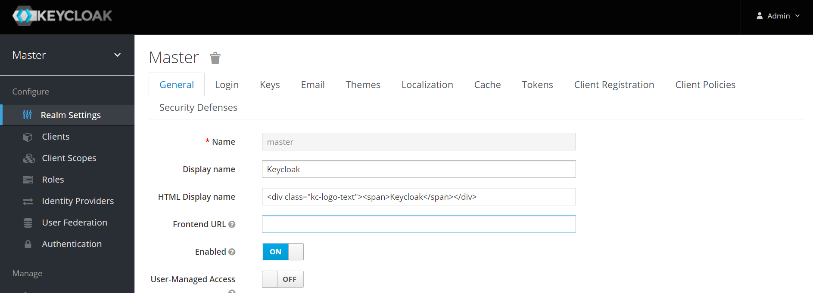
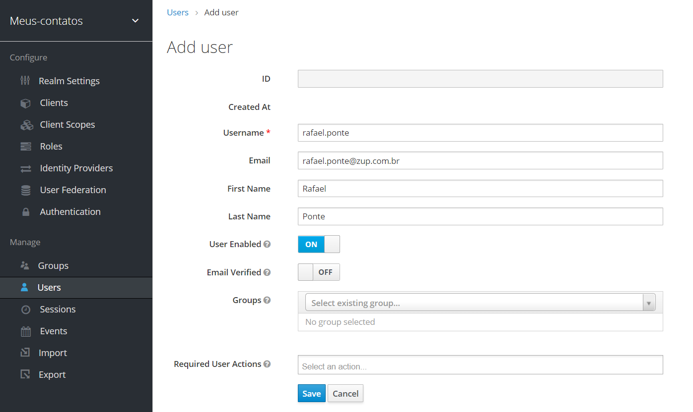
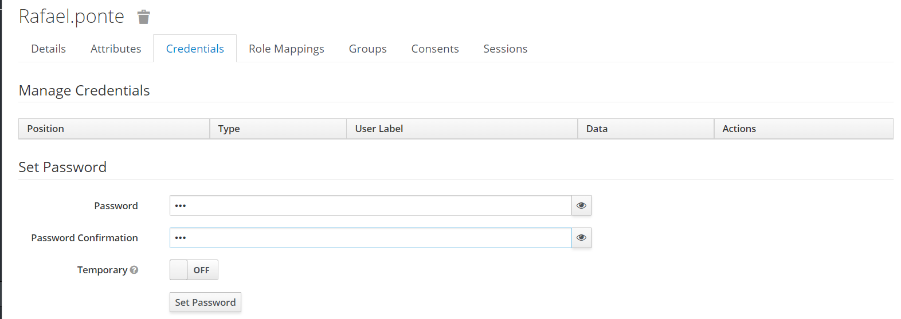
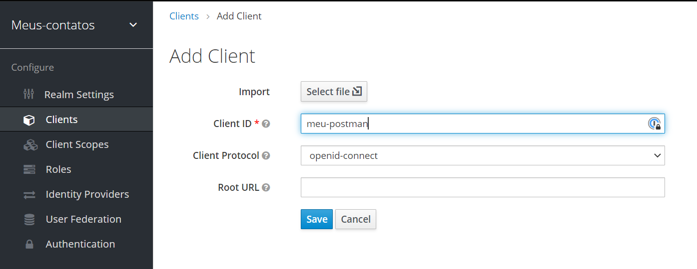
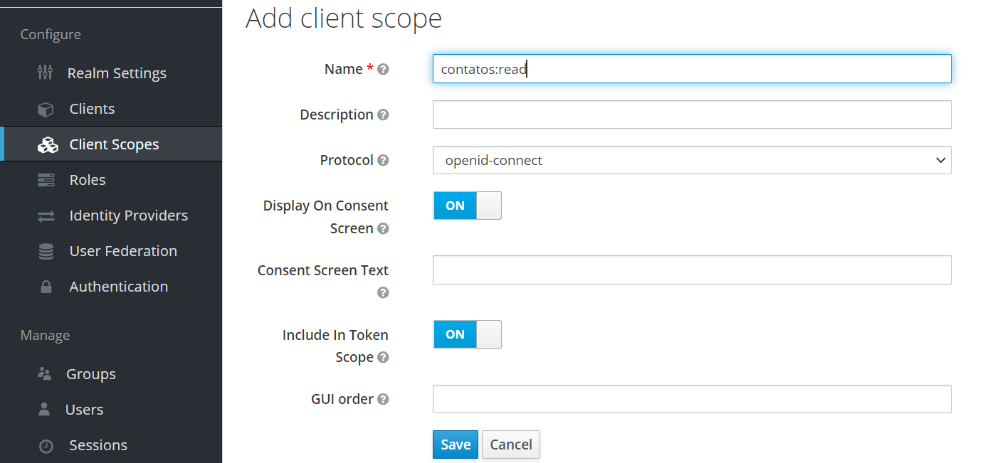
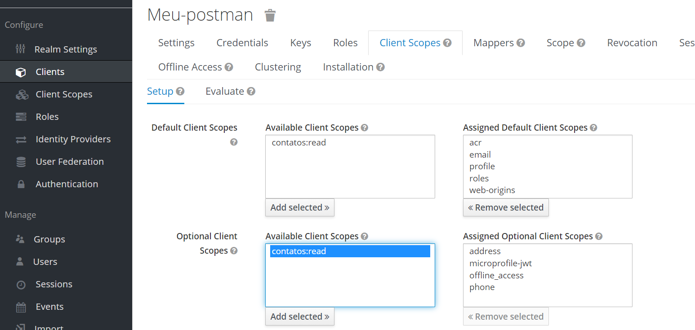

# Configurando Resource Owner Password Credentials Flow no Keycloack

Nesse conteúdo veremos como podemos configurar um Client no Keycloak com o fluxo OAuth2 mais popular, o **Resource Owner Password Credentials Flow**.

## Configurando novo fluxo

Antes de começar, assumimos que você já tenha configurado e esteja rodando seu servidor Keycloak localmente via container Docker ou Docker-Compose.

Para configurar o **Resource Owner Password Credentials Flow** no Keycloack, basta seguir os **7 passos** descritos abaixo:

- [1. Faça o login no Admin Console](#1-fa%C3%A7a-o-login-no-admin-console)
- [2. Crie um novo Realm](#2-crie-um-novo-realm)
- [3. Crie um User](#3-crie-um-user)
- [4. Crie um Client](#4-crie-um-client)
- [5. Configure o fluxo do seu Client](#5-configure-o-fluxo-do-seu-client)
- [6. Crie um ou mais Client Scopes](#6-crie-um-ou-mais-client-scopes)
- [7. Associe os Scopes ao Client](#7-associe-os-scopes-ao-client)

No final deste documento, temos também alguns links de artigos e referências que podem te ajudar nos estudos: [Links e referências](#links-e-refer%C3%AAncias)

### 1. Faça o login no Admin Console

Acesse o [Admin Console do Keyclock](http://localhost:18080/admin/) e faça o login com usuário que definimos no nosso container Docker (provavelmente usuário `admin` e senha `admin`).

Esta é a URL de acesso ao Admin Console do Keycloak: http://localhost:18080/admin/ (rodando na porta `18080`).

### 2. Crie um novo Realm

Um Realm no Keycloak é equivalente a um inquilino (tenant). Ele nos permite criar grupos isolados com configurações de aplicações (clients), usuários, escopos etc. Por padrão, existe um único Realm no Keycloak chamado de `master`, mas ele é dedicado a gerenciar o Keycloak e não deveria ser utilizado para nossas própria aplicações.

Vamos criar nosso Realm, então:

1. Abra [Admin Console do Keyclock](http://localhost:18080/admin/);
2. Mova o mouse para o dropdown no topo a esquerda onde diz `Master`, e então clique em `Add realm`;
3. Preencha o formulário com o seguintes dados:
    - Name: `meus-contatos`
4. Clique em `Create`;

Após criar o Realm, estaremos dentro dele (você pode ver o nome do Realm no canto superior esquerdo) Dessa foma, a partir de agora tudo que criarmos ou configurarmos estará vinculado a este Realm.

### 3. Crie um User

Inicialmente quando criamos um novo Realm ele não possui usuários. Por esse motivo, vamos criar um novo usuário.

1. Selecione o Realm que acabamos de criar (topo a esquerda);
2. Selecione o menu `Users` (menu a esquerda, sessão `Manage`);
    - Clique em `Add user`;
3. Agora preencha o formulário com os seguintes valores:
    - Username: `rafael.ponte`;
    - Email: `rafael.ponte@zup.com.br`;
    - First Name: `Rafael`;
    - Last Name: `Ponte`;
5. Por fim, clique em `Save`;

Nosso usuário vai precisar de uma senha (password) para que ele consiga logar. Para isso, ainda no formulário do usuário récem criado, siga os passos:

1. Clique na aba `Credentials` (topo da página);
2. Preencha a sessão `Set Password` com sua nova senha (recomendamos uma senha fácil, como `123`);
3. No campo `Temporary`, configure-o para `OFF` para que o usuário não tenha que redefinir a senha no primeiro acesso;

Pronto! Agora este usuário válido pode ser utilizados em nosso ambiente de desenvolvimento e testes.

> **Account Console**  
> Para gerenciar a conta e perfil de um usuário, podemos logar no [Account Console](http://localhost:8080/realms/myrealm/account) do Keycloak. Para isso, basta acessar o endereço http://localhost:8080/realms/myrealm/account e em seguida entrar com o `username` e `password` configurados para um usuário criado anteriormente.

### 4. Crie um Client

Um Client no Keycloak nada mais é do que uma aplicação, como um sistema web, SPA (Single-Page Application), aplicativo mobile, aplicação frontend, microsserviço, entre outros. É aqui que configuramos as diretrizes de segurança, fluxos OAuth2 e regras de acesso para uma determinado Client.

Inicialmente quando criamos um Realm o mesmo já vem com alguns Clients padrões pré-configurados. Não faz muito sentido utilizá-los, por esse motivo vamos criar um novo Client que represente nossa aplicação.

Por simplicidade, vamos considerar que o POSTman ou Insomnina sejam nossas aplicações, dessa forma siga os passos abaixo:

1. Selecione o Realm que acabamos de criar (topo a esquerda);
2. Selecione o menu `Clients` (menu a esquerda, sessão `Configure`);
    - Clique em `Create`;
3. Preencha o formulários com o seguintes valores:
    - Client ID: `meu-postman`;
    - Client Protocol: `openid-connect`;
    - Root URL: podemos deixar em branco, mas aqui entramos com a URL raiz da nossa aplicação;
4. Clique em `Save`;

> **Testando seu Client**  
> Podemos testar nosso Client via [aplicação SPA de testes do site do Keycloak](https://www.keycloak.org/app/). Para isso, antes de mais nada precisamos configurar o campo Root URL do nosso Client com `https://www.keycloak.org/app/`.
>
> Em seguida, acesse https://www.keycloak.org/app/, entre com as informações do seu Client recem criado e clique em `Save`. Por fim, clique em `Sign in` para autenticar para esta aplicação (Client) usando nosso Keycloak local.
>
> No fim, se você percebeu, a aplicação SPA do site do Keycloak se comportou como nosso Client.

### 5. Configure o fluxo do seu Client 

Após criar o novo Client, o formulário foi expandido com novos campos novas e novas abas. A partir de agora podemos configurar em mais detalhes nosso Client, como por exemplo configurando seus fluxos OAuth2, tipo de acesso, URLs de redirecionamento permitidas, detalhes do OpenID Connect e muitas outras.

Por este momento, vamos configurar somente o fluxo OAuth2 necessário para nosso Client (aplicação). Para configurar o fluxo **Resource Owner Password Credentials Flow**, basta seguir os passos abaixo:

1. Ainda no formulário de Client, preencha o formulário com os seguints valores:
    - Access Type: `confidential`;
    - Standard Flow Enabled: configure-o como `OFF`;
    - **Direct Access Grants Enabled**: configure-o como `ON` para habilitar o Resource Owner Password Credentials Flow;
2. Clique em `Save`;

A configuração mais importante neste formulário foi a do campo **Direct Access Grants Enabled**, pois é ela quem habilita nosso fluxo **Resource Owner Password Credentials Flow**.

> **Entenda cada campo do formulário**  
> A nomenclatura do protocolo OAuth2 não é das mais fáceis, e geralmente os Authorization Servers adaptam seus nomes para algo que faça mais sentido para seus usuários, tornando tudo ainda mais confuso.
>
> No caso do Keycloak, em caso de dúvida sobre algum campo de um formulário, basta passar o mouse em cima do **icone de interrogação `(?)`** para que apareça uma tooltip descrevendo o campo e sua relação com o protocolo OAuth2.

Além disso, repare que configuramos o campo _Access Type_ como `confidential` para indicar que o Client (aplicação) precisa de uma Secret para iniciar o protocolo de login. Ao fazer isso, e após clicar em `Save`, uma nova aba `Credentials` aparece no formulário de Client, e é justamente nela que obtemos e gerenciamos a **Secret** do nosso Client.

Embora opcional, nós também desabilitamos o _Standard Flow Enabled_, pois se trata de um outro fluxo OAuth2 que não precisamos neste momento.

### 6. Crie um ou mais Client Scopes

Scopes, ou escopos,  é um mecanismo no OAuth 2.0 para limitar o acesso de uma aplicação à conta de um usuário. Uma aplicação pode requisitar um ou mais escopos, esta informação é então apresentada ao usuário na tela de consentimento, e o Access Token gerado para aplicação será limitado de acordo com esses escopos. Lembre-se, a idéia de uma aplicação é ter acesso ou executar alguma ação em nome de um usuário especifico, e são justamente os Scopes que limitam o que uma aplicação (Client) pode ou não fazer.

Inicialmente quando criamos um novo Realm, este já possui alguns Scopes pré-definidos. Mas podemos e devemos criar os nossos Scopes de acordo com as regras de acesso que queremos dar à nossas aplicações.

No Keycloak, para criar novos Scopes, basta seguir os passos abaixo:

1. Selecione o Realm que acabamos de criar (topo a esquerda);
2. Selecione o menu `Client Scopes` (menu a esquerda, sessão `Configure`);
    - Clique em `Create`;
3. Preencha o formulário com os seguintes valores:
    - Name: `contatos:read`;
4. Clique em `Save`;

Criar Client Scopes é bem simples!! Se você desejar, você pode criar quantos Scopes você desejar. A idéia é que eles possam ser utilizados e reutilizados entre Clients distintos dentro do seu Realm.

> **Cuidado com a granularidade dos seus Scopes**  
> É muito comum que o Scopes tenha granularidades mais grossas, como por exemplo `read` e `write`. Determinar a granularidade é importante e está intimamente ligado as regras de acesso que queremos fornecer aos nossos Clients. Ter uma granularidade muito grossa pode acabar dando muito poder ao um Client, enquanto uma granularidade muito fina pode restringir demais seu acesso e dificultar a configuração e manutenção do Resource Server.
>
> Por exemplo, se temos uma API REST de Contatos que permite listar todos os contatos cadastrados e criar novos contatos, poderiamos ter 2 Scopes simples: `contatos:read` para leitura e `contatos:write` para escrita. Mas isso depende de contexto para contexto.

O próximo passo agora é associar este(s) Scope(s) ao nosso Client, vamos lá?

### 7. Associe os Scopes ao Client

Os Scopes tem significado somente quando associamos eles a um ou mais Clients, e é neste passo que faremos isso.

Por fim, precisamos associar os Scopes a um ou mais Clients, para isso siga os passos:

1. Selecione o Realm que acabamos de criar (topo a esquerda);
2. Acesse o menu `Clients` (menu a esquerda, sessão `Configure`)
    - Clique no Client `meu-postman` para edição;
3. No formulário, clique na aba `Client Scopes` e em seguida:
    - No campo Optional Client Scopes, selecione o escopo `contatos:read`;
    - Clique em `Add selected`;

Pronto! Agora nosso Client possui Scopes associados que precisam ser informados pelo Client no momento de solicitar um Access Token.

> **Client Scopes: Default VS Optional**  
> Default Client Scopes são escopos consedidos sempre que uma aplicação solicita um Access Token. Enquanto Optional Client Scopes são escopos consedidos somente se explicitamente informados no momento de solicitar um Access Token.
>
> É comum utilizarmos Optional Client Scopes para limitar o que determinados Clients podem ou não fazer em nome de um usuário do sistema.

### Pronto! Client Configurado!

Prontinho! 🥳🥳 
Não foi tão dificil assim, não é mesmo? Com o tempo criar e configurar Realms, Users, Client e Scopes se tornará fácil e comum para você. 

Agora, nosso Client com Resource Owner Password Credentials Flow está configurado e pronto para uso! Para testa-lo, você pode usar algum HTTP client como POSTman ou Insomnia. Se tiver dúvida de como fazer isso, basta consultar nosso material teorico!

## Links e referências

Alguns são alguns links de artigos e referências oficiais e não oficiais que podem te ajudar no aprendizado e aprofundamento:

- [Keycloak Website](https://www.keycloak.org/)
- [Keycloak: Server Administration Guide](https://www.keycloak.org/docs/latest/server_admin/)
- [OAuth 2.0 Terminology Reference](https://www.oauth.com/oauth2-servers/definitions/)
- [OAuth 2.0 Resource Owner Password Credentials Grant](https://oauth.net/2/grant-types/password/)
- [OAuth 2.0 Client Types](https://oauth.net/2/client-types/)
- [OAuth Scopes](https://oauth.net/2/scope/)