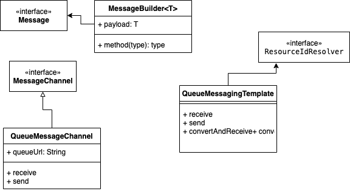

# Entendendo o Spring Messaging

## Principais classes 

<p align="center">

</p>


A interface Message representa a mensagem SQS.

QueueMessageChannel e QueueMessagingTemplate são as classes usadas para enviar e receber mensagens. 

Para receber, a classe possui um método para pesquisa de mensagens e outro método que adiciona uma anotação SQSListener.
 
É possível substituir a configuração padrão usada por todas as integrações com ClientConfiguration. 

As opções de configuração do cliente controlam como um cliente se conecta ao Amazon SQS com atributos como configurações de proxy, contagens de novas tentativas etc.


## Recendo mensagens

Existem duas formas de receber mensagens de uma fila SQS. 
Nas duas formas quem realiza a consulta é o cliente e não o Broker.
Para receber uma mensagem, a aplicação consultará através de bibliotecas que facilitam usar a API do SQS para verificar novas mensagens.
Existem duas maneiras de pesquisar novas mensagens do SQS:

### Short Polling 

Esta abordagem retorna na hora que é feita a consulta da mensagem, mesmo que não retorne com a mensagem pois a fila não possui mensagens.
Para essa abordagem é possível utilizar a classe QueueMessagingTemplate e o método receive(), fazendo um loop infinito que pesquisa regularmente a fila.
Porém essa abordagem é custosa do ponto de vista de processamento e de consulta da api, porque a todo momento esse processamento precisa estar ativo realizando busca de mensagens.

### Long Polling

Esta abordagem não retorna uma resposta até que uma mensagem chegue na fila de mensagens ou a sondagem longa expire. 
Para implementar utilizamos a anotação @SQSListener sobre o método que realiza o recebimento da mensagem.
Essa abordagem acaba sendo a mais utilizada porque acaba retornando apenas quando recebe uma mensagem e gera menos custo na consulta da api.

## Spring 

### spring-cloud-aws-messaging
 A Biblioteca que possui as classes implementadas e que utilizamos durante o desenvolvimento que utilize SQS.

### spring-cloud-starter-aws-messaging
 Utiliza a biblioteca e implementa as configurações default e criação de Beans com a integração com Spring Boot. 

### Consumer
Com o starter o beans relacionados ao consumo de mensagens já serão instanciados, mas podemos instaciar nosso próprio Bean do Listener.

```java
   @Bean
   public SimpleMessageListenerContainerFactory simpleMessageListenerContainerFactory(AmazonSQSAsync amazonSQS, AsyncTaskExecutor asyncTaskExecutor){
        SimpleMessageListenerContainerFactory factory = new SimpleMessageListenerContainerFactory();
        //Define o AmazonSQSAsyncque será usado pelo contêiner para interagir com a API de mensagens (SQS).
        factory.setAmazonSqs(amazonSQS);
        //Configure o número máximo de mensagens que devem ser recuperadas durante uma sondagem no sistema Amazon SQS.
        factory.setMaxNumberOfMessages(10);
        //O número de milissegundos que o encadeamento de sondagem deve esperar antes de tentar se recuperar quando ocorrer um erro
        factory.setBackOffTime(500l);
        //Configura o TaskExecutorque é usado para sondar mensagens e executá-las chamando os métodos do manipulador.
        factory.setTaskExecutor(asyncTaskExecutor);
        return factory;
        }
```

[Documento completo da Classe](https://www.javadoc.io/static/org.springframework.cloud/spring-cloud-aws-messaging/2.2.0.RELEASE/org/springframework/cloud/aws/messaging/config/SimpleMessageListenerContainerFactory.html)

## Converter
Hoje, o Spring faz já a conversão do objeto automáticamente através dos Beans que foram instanciados, porém é possível configurar o conversor na "mão", criando um novo bean novamente.

```java
    @Bean
    public QueueMessageHandlerFactory queueMessageHandlerFactory(MessageConverter messageConverter) {

        var factory = new QueueMessageHandlerFactory();
        factory.setArgumentResolvers(singletonList(new PayloadArgumentResolver(messageConverter)));
        return factory;
    }

    @Bean
    protected MessageConverter messageConverter(ObjectMapper objectMapper) {

        var converter = new MappingJackson2MessageConverter();
        converter.setObjectMapper(objectMapper);
        // Serialization support:
        converter.setSerializedPayloadClass(String.class);
        // Deserialization support: (suppress "contentType=application/json" header requirement)
        converter.setStrictContentTypeMatch(false);
        return converter;
    }
```


## Politica de exclusão

A biblioteca possui a classe SqsMessageDeletionPolicy destinada para informar quais a abordagem.
Conforme a documentação:

- ALWAYS: Sempre exclui a mensagem em caso de sucesso (sem exceção lançada) ou falha (exceção lançada) durante o processamento da mensagem pelo método do ouvinte.
- NEVER: Nunca exclui a mensagem automaticamente. O método do ouvinte receptor deve confirmar cada mensagem manualmente usando o parâmetro de confirmação.
- NO_REDRIVE: Exclui a mensagem se nenhuma política de redrive for definida.
- ON_SUCCESS: Exclui a mensagem quando executada com sucesso pelo método do listener. Se uma exceção for lançada pelo método do ouvinte, a mensagem não será excluída.

#### Link de Referência

https://docs.spring.io/spring-boot/docs/current/reference/html/messaging.html
https://reflectoring.io/spring-cloud-aws-sqs/
https://aws.amazon.com/blogs/opensource/getting-started-with-spring-boot-on-aws-part-1/
https://stratospheric.dev/
https://cloud.spring.io/spring-cloud-static/spring-cloud-aws/2.2.0.M2/reference/html/
https://spring.io/blog/2021/03/17/spring-cloud-aws-2-3-is-now-available
https://cloud.spring.io/spring-cloud-static/spring-cloud-aws/2.0.0.RELEASE/multi/multi__messaging.html

