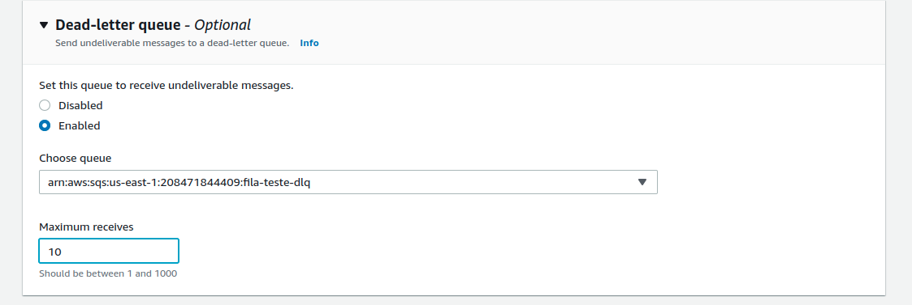

# O que é uma DLQ 

Filas de mensagens mortas, é uma fila, porém com um propósito de receber as mensagens que não conseguiram ser processadas em sua fila de origem.

Usualmente quando uma mensagem acaba dado erro em seu processamento, ela pode ser um bloqueio para a leitura das demais mensagens então é importante para que não interrompa o fluxo de mensagens que essa mensagem seja removida do caminho para que as mensagens sequentes consigam ser processadas.

Seguindo o uso de DLQ conseguimos isolar melhor mensagens com falhas para depurarmos do porque seu processamento não esta sendo efetuado e realizar as correções necessárias.

O uso e configuração da DLQ pode variar com o serviço de fila ou broker que esta sendo utilizado.

## DLQ no SQS

Para utilizarmos DLQ no SQS precisamos primeiro configurar uma fila que servirá para receber as mensagens que não foram processadas de outra fila e ao criarmos a fila principal precisamos indicar qual fila servirá como sua DLQ.

### Dead-letter queue

Se uma mensagem não puder ser consumida com êxito, você poderá enviá-la para uma fila de mensagens mortas (DLQ). As filas de mensagens mortas permitem isolar mensagens problemáticas para determinar por que elas estão falhando.

Quando você designa uma fila para ser uma fila de origem, uma DLQ não é criada automaticamente. Você deve primeiro criar uma fila para designar como DLQ. O tipo de fila DLQ (padrão ou FIFO) deve corresponder às filas de origem. Você pode associar o mesmo DLQ a mais de uma fila de origem.

O valor Máximo de recebimentos determina quando uma mensagem será enviada ao DLQ. Se o ReceiveCount de uma mensagem exceder a contagem máxima de recebimento da fila, o Amazon SQS moverá a mensagem para o DLQ associado (com seu ID de mensagem original).

Você deve usar a mesma conta da AWS para criar o DLQ e as filas de origem que enviam mensagens para o DLQ. Além disso, o DLQ deve residir na mesma região que as filas de origem que usam o DLQ.

A fila DLQ d euma Fila fifo também deve seguir a convenção de nomes e deve ser o tipo FIFO.


Exemplo:

Vamos criar uma fila usando a AWS CLI, essa fila será utilizada como DLQ:

```shell
aws --endpoint-url=http://localhost:4566 sqs create-queue --queue-name teste_dlq
```

Agora vamos criar a fila que receberá as mensagens e vamos configurar a fila que será a DLQ dela:

```shell
aws sqs create-queue --queue-name teste \
    --attributes '{"RedrivePolicy": "{\"deadLetterTargetArn\":\"arn:aws:sqs:sa-east-1:000000000000:teste_dlq\",\"maxReceiveCount\":\"2\"}"}' \
    --endpoint-url=http://localhost:4566
```

Toda vez que uma mensagem é lida e devolvida para a fila é alterado o receiveCount, quando parametrizamos o maxReceiveCount, significa que quando o ReceiveCount chegar no valor parametrizado do maxReceiveCount é quando a mensagem será redirecionada para a fila de DLQ.

Quando realizamos a configuração pelo console da AWS também temos a opção para preenchimento:

<p align="left">

</p>


### Redrive allow policy

A política de permissão de redirecionamento define quais filas de origem podem usar essa fila como a fila de mensagens mortas.

Por padrão, a política de permissão de redirecionamento está desabilitada, o que resulta no mesmo comportamento de permitir que todas as filas de origem usem essa fila como a fila de mensagens mortas.

Ao habilitar a política de permissão de redirecionamento, você pode optar por permitir ou negar todas as filas de origem ou especificar uma lista de até 10 filas de origem por ARN.

As filas de origem devem ser de propriedade da mesma conta da AWS e devem residir na mesma região que a fila de mensagens mortas.


#### Links de Referência 

https://aws.amazon.com/blogs/compute/introducing-amazon-simple-queue-service-dead-letter-queue-redrive-to-source-queues/
https://faun.pub/aws-sqs-with-dead-letter-queue-dlq-local-setup-using-localstack-346dbad98849
